# Estadística espacial
```{r echo=FALSE}
options(knitr.graphics.auto_pdf = TRUE)
```

## Preliminares

### Función Aleatoria

Dado un dominio $D\subset \mathbb{R}^n$ y un espacio de probabilidad $(\Omega,\mathcal{A},P)$, una función aleatoria es una función de dos variables $Z(x,\omega)$ tal que para cada $x\in D$, $Z(x,.)$ es una variable aleatoria en $(\Omega,\mathcal{A},P)$. Por otro lado, $Z(.,\omega)$, definido en $D$ como la sección de la función aleatoria en $\omega \in \Omega$ es una realización de la función aleatoria. La función aleatoria $Z(x,\omega)$ se denota como $Z(x)$ y una realización es representada por $z(x)$ [@GeoJean].

### Proceso Estocástico

Según [@GeoJean], una función aleatoria es llamada proceso estocástico cuando $x$ varia en un espacio unidimensional como el tiempo; por otro lado, si $x$ varia en más de una dimensión es conocido como campo aleatorio.

### Proceso Espacial

Sea $Z$ la variable aleatoria de interés y $s$ su ubicación espacia. El proceso espacial es el proceso estocástico

$$\{Z(s):s \in D\}$$

donde $D \subset \mathbb{R}^d$ es el conjunto formado por todas las ubicaciones espaciales [@marta].

### Proceso Temporal

Sea $Z$ la variable aleatoria de interés y $t$ el tiempo. El proceso temporal es el proceso estocástico

$$\{Z(t):t \in D\}$$

donde $D \subset \mathbb{R}$ es el conjunto formado por todos los instantes de tiempo [@marta].

### Proceso Espacio Temporal

Sea $Z$ la variable aleatoria de interés, $s$ su ubicación espacial y $t$ el tiempo de ocurrencia. Un proceso espacio-temporal es un proceso estocástico

$$\{Z(s,t):(s,t) \in D \times D' \}$$

donde el conjunto $D \subset \mathbb{R}^d$ es el conjunto de todas las ubicaciones espaciales y el conjunto $D' \subset \mathbb{R}$ es el conjunto de todos los instantes de tiempo. Los conjuntos $D$ y $D'$ pueden ser continuos o discretos, fijos o aleatorios [@marta].

## Clases de Datos Espaciales

Dependiendo de las características del dominio espacial $D$ del proceso estocástico de interés, se tienen los siguientes tipos de datos espaciales principales, los cuales son geoestadística, datos de área o \textit{lattice}, procesos o patrones espaciales puntuales y datos georreferenciados.

### Geoestadística

Es el conjunto de métodos aplicados a datos espaciales, donde las ubicaciones espaciales $s$ provienen de un conjunto continuo y fijo $D \subset \mathbb{R}^d$; cabe resaltar que el propósito de la geoestadística es la interpolación. Además, si el conjunto $D$ no es continuo se puede llegar a obtener predicciones carentes de sentido, y se considera $D$ fijo pues los puntos en el espacio se seleccionan a conveniencia o bajo un esquema de muestreo probabilístico [@Ramon].

### Datos de Área

En este tipo de datos las ubicaciones espaciales pertenecen a un conjunto discreto contable y fijo $D \subset \mathbb{R}^d$. Las ubicaciones pueden estar espaciadas regular o irregularmente, usualmente son irregulares pues sus separaciones no siguen un patrón predecible.[@Cressi].

### Patrones Puntuales

En este caso, las ubicaciones espaciales pertenecen a un conjunto discreto o continuo y aleatorio $D\subset \mathbb{R}^d$. Con este tipo de dato se realizan análisis con el propósito de determinar si la distribución de las mediciones en la región es aleatoria, agregada o uniforme [@Ramon].

### Datos Georreferenciados

En este caso, las variables de interés tienen asociadas las coordenadas de las ubicaciones donde fueron medidas, las que pueden ser geográficas, planas o cartesianas [@Ramon].

## Geoestadística

La palabra geoestadística fue establecida por Hart en el año de 1954. El significado de esta palabra se lo puede deducir a partir de su prefijo geo, que hace referencia a la tierra; por lo tanto, la geoestadística es una rama de la estadística enfocada en el análisis y la modelización de la variabilidad espacial de fenómenos que ocurren dentro de una zona geográfica; además, es considerada como una disciplina híbrida entre Geología, Matemática, Estadística y Minería de datos [@Cressi].

### Variable Regionalizada

Una variable regionalizada es un proceso estocástico con dominio continuo contenido en un espacio euclidiano d-dimensional $\{Z(s):s\in D\subset \mathbb{R}^d\}$.

En el caso de que las mediciones sean realizadas en una superficie; es decir, $d=2$, $Z(s)$ puede asociarse a la variable aleatoria ligada a ese punto del plano, $s$ representa las coordenadas geográficas y $Z$ la variable en cada una de ellas. La medición de esta variable aleatoria puede representar la magnitud de una variable ambiental medida en un conjunto de coordenadas en la región de estudio [@Ramon].

Un proceso estocástico espacial se caracteriza por su distribución de probabilidad de dimensión finita; es decir, la distribución de probabilidad conjunta de un conjunto de variables $Z(s_1),...,Z(s_k)$ para todo $k \in \mathbb{N}$ y para todos los puntos $s_1,...s_k \in D$ [@marta].

### Función de Distribución Conjunta

Considérese una función/campo aleatorio $Z=\{Z(s):s\in D\}$ y $k$ ubicaciones espaciales $s_1,...,s_k \in D$. El vector aleatorio $\{Z(s_1),...,Z(s_k)\}$ está caracterizado por su función de distribución conjunta:

$$F_{s_1,...,s_k}(z_1,...,z_2)=P[Z(s_1)\leq z_1,...,Z(s_k)\leq z_k]$$

### Función de Media

La esperanza o el momento de primer orden de un campo aleatorio o proceso estocástico espacial $Z(s)$, es una función no aleatoria de $s$

```{=tex}
\begin{align*}
E[Z(s)]=\mu(s)\quad\text{donde}\quad \mu(s_i)=E(Z(s_i))\ i=1,...,k    
\end{align*}
```
En cada sitio $s$ dado, $\mu(s)$ representa la media alrededor de la cual se distribuyen los valores tomados por las realizaciones de la funciones aleatoria [@Ramon]. Si la esperanza del campo aleatorio varía con la ubicación espacial, se le conoce como deriva o *drift* del campo aleatorio.

En geoestadística existen tres elementos de segundo orden, los cuales son: varianza, convarianza y variograma.

**EJEMPLO DE MEDIA CON CALCIO, AQUIFER, NITRATO(MARTA)**

### Función de varianza

La varianza de un campo aleatorio o proceso estocástico espacial $Z(s)$ respecto a $\mu(s)$, está definida por:

```{=tex}
\begin{align*}
  V(s)=\sigma^2(s)=Var[Z(s)]=E[(Z(s)-\mu(s))^2]\quad \text{donde} \quad V(s_i)=\sigma^2(s_i)=V(Z(s_i))\ i=1,...,k
\end{align*}
```
**EJEMPLO DE VARIANZA CON CALCIO, AQUIFER, NITRATO(MARTA)**

### Función de Covarianza

Sean $Z(s_i)$ y $Z(s_j)$ dos variables aleatorias de un proceso estocástico espacial, la covarianza es una función de separación espacial de $s_i$ y $s_j$ y está definida por:

```{=tex}
\begin{align*}
  C(s_i,s_j)&=C(s_i-s_j)\\ \\
  C(s_i,s_j)&=C(Z(s_i),Z(s_j))\\ \\
  C(s_i,s_j)&=E[(Z(s_i)-\mu(s_j))(Z(s_j)-\mu(s_j))]\\ \\
  C(s_i,s_j)&=E[Z(s_i)Z(s_j)]-\mu(s_i)\mu(s_j)
\end{align*}
```
Nótese que:

```{=tex}
\begin{align*}
  C(s,s)=C(0)=\sigma^2(s)  
\end{align*}
```
**EJEMPLO DE COVARIANZA CON CALCIO, AQUIFER, NITRATO(MARTA)**

### Función de correlación o Correlograma

La correlación lineal de dos variables aleatorias de un proceso estocástico espacial $Z(s_i)$ y $Z(s_j)$, está definida por:

```{=tex}
\begin{align*}
  \rho(s_i,s_j)=\frac{C(s_i,s_j)}{\sigma(s_i)\sigma(s_j)}  
\end{align*}
```
### Función de semi-variograma

El semi-variograma entre dos variables aleatorias de un proceso estocástico espacial $Z(s_i)$ y $Z(s_j)$ está dado por:

```{=tex}
\begin{align*}
  \gamma(s_i,s_j)=\gamma(s_i-s_j)= \frac{1}{2} V[Z(s_i)-Z(s_j)], \ \forall s_i,s_j \in D 
\end{align*}
```
**EJEMPLO DE VARIOG CON CALCIO, AQUIFER, NITRATO(MARTA)**

### Estacionariedad de Funciones Aleatorias

Una variable aleatoria regionalizada vista como una realización de un proceso estocástico espacial o función aleatoria $\{Z(s):s\in D\}$, probabilísticamente adquiere sentido cuando es posible inferir toda o parte de la ley de probabilidad del proceso estocástico o campo aleatorio. Es claro que inferir la ley de probabilidad cuando solo se tiene una realización del proceso estocástico espacial o función aleatorio sería imposible; para poder hacer inferencia consistente, se necesitan de varias realizaciones, pero en la realidad solo existe una, inclusive solo una parte de las realizaciones está disponible en las ubicaciones de la muestra; para dar solución a este problema, se introduce el supuesto de estacionariedad, que significa que la ley de probabilidad espacial del proceso estocástico espacial o función aleatoria, o parte de este, es invariante respecto a traslaciones; es decir, las propiedades probabilísticas de un conjunto de observaciones no dependen de las ubicaciones donde fueron medidas, solo dependen de su separación; además, como se mencionó, las realizaciones no son independientes [@montero]. Así, se distinguen tres tipos de estacionariedad:

-   Estacionariedad fuerte o de primer orden.
-   Estacionariedad débil o de segundo orden.
-   Estacionariedad intrínseca .

#### Estacionariedad Fuerte o de primer orden {.unnumbered}

Este supuesto se refiere a que el proceso alcanza un estado de equilibrio. Formalmente, una variable regionalizada es estacionaria si su función de distribución no varía con la traslación del vector $\textbf{h}$; esto es, si para:

```{=tex}
\begin{align*}
    Z(s)&=[Z(s_1),...,Z(s_n)]^{'} \\ \\
    Z(s+\textbf{h})&=[Z(s_{1} +\textbf{h}),...,Z(s_{n} + \textbf{h} )]^{'}
\end{align*}
```
se tiene que:

```{=tex}
\begin{align*}
  F_{Z_1,...,Z_n}(s_1,...,s_n)=F_{Z_1,...,Z_n}((s_1+\textbf{h}),...,(s_n+\textbf{h}))  
\end{align*}
```
Nótese que esta condición es muy restrictiva, por lo que normalmente se relaja a condiciones de segundo orden, las que limitan el supuesto de estacionariedad a los dos primeros momentos del proceso estocástico o campo aleatorio [@montero].

**EJEMPLOS (MARTA)??**

#### Estacionariedad de Segundo Orden {.unnumbered}

Sea $\{Z(s): s\in D \}$ un proceso estocástico o campo aleatorio, se dice débilmente estacionario o de segundo orden si tiene momentos de segundo orden finitos; es decir, que la covarianza existe y se verifica que:

-   La esperanza existe, es constante a través del dominio $D$, y no depende de la ubicación $s$; es decir:

    ```{=tex}
    \begin{align*}
        E(Z(s))=\mu(s)=\mu  
      \end{align*}
    ```

-   La covarianza existe para todo par de variables aleatorias, $Z(s)$ y $Z(s+\textbf{h})$, y solo depende del vector de separación $\textbf{h}$ entre las ubicaciones $s$ y $s+\textbf{h}$; es decir, depende de la dirección y la distancia de separación, y no de sus ubicaciones absolutas y se tiene que:

    $$
    \begin{align*}
        Cov(Z(s),Z(s+\textbf{h}))=C(\textbf{h}),\forall s\in D \ y\ \textbf{h}\in \mathbb{R}^d  
      \end{align*}
    $$

La estacionariedad de la covarianza implica que la varianza $Var(Z(s))$ existe, es finita y no depende de $s$; es decir:

```{=tex}
\begin{align*}
        Var(Z(s))&=\sigma^2(s)=C(s,s)=C(s-s)=C(0)=\sigma^2  
\end{align*}
```
La estacionariedad de segundo orden implica la siguiente relación entre entre la función de semivarianza y la de autocovarianza:

```{=tex}
\begin{align*}
    \gamma(\textbf{h})&=\frac{1}{2}V(Z(s+\textbf{h})-Z(s)), \quad \text{con} \ \gamma(\textbf{h})=\gamma(s+\textbf{h},s)\\
&=\frac{1}{2}(V(Z(s+\textbf{h}))+V(Z(s))+2C(Z(s+\textbf{h}),Z(s)))\\
&=\frac{1}{2}(C(0)+C(0)+2C(\textbf{h}))\\
&=C(0)-C(\textbf{h})
\end{align*}
```
Nótese que si un proceso estocástico o campo aleatorio es estacionario de segundo orden, entonces también será un proceso estocástico estacionariamente fuerte; sin embargo, esto no ocurre en el sentido contrario.

Se debe tener en cuenta que la estacionariedad de segundo orden implica la existencia de la varianza del proceso estocástico o campo aleatorio. Existen fenómenos con varianza infinita lo que imposibilita su modelización utilizando procesos de este tipo. Sin embargo, existen casos en los que los incrementos, $Z(s+\textbf{h})-Z(s)$, tienen varianza finita y que además son un proceso estacionario de segundo orden; este tipo de proceso estocástico o campo aleatorio se conoce como un proceso con estacionariedad intrínseca [@montero].

**EJEMPLOS (MARTA)??**

#### Estacionariedad Intrínseca {.unnumbered}

Sea $\{Z(s): s\in D\}$ un proceso estocástico o campo aleatorio; se dice que es un proceso con estacionariedad intrínseca, si:

-   $Z(s)$ tiene esperanza finita y constante para todo punto en el domino, lo cual implica que la esperanza de los incrementos sea cero.

    $$E(Z(s+\textbf{h})-Z(s))=0$$

-   Para cualquier vector $\textbf{h}$, la varianza del incremento está definida y es una función única de la distancia.

    $$V(Z(s+\textbf{h})-Z(s))=E(Z(s+\textbf{h})-Z(s))^2=2\gamma(\textbf{h})$$

**EJEMPLOS (MARTA)??**

### No estacionariedad de Funciones Aleatorias

Sea $\{Z(s): s\in D\}$ un proceso estocástico o campo aleatorio para el cual la media y/o la función de covarianza depende de la ubicación espacial; es decir, no son traslacionalmente invariantes; se dice que $Z(s)$ es una función aleatoria no estacionaria.

Cuando el proceso estocástico o campo aleatorio $\{Z(s): s\in D\}$ tiene media no constante y varia con la ubicación espacial, y sus incrementos de primer orden $Z(s+\textbf{h})-Z(s)$ son no estacionarios, se dice que la función aleatoria es no intrínseca [@montero].

**EJEMPLOS (BUSCAR)??**

### Isotropía

Identificar la estacionariedad en un campo temporal es fácil, ya que solo existe una dirección de variación. Por otro lado, en el campo espacial existen múltiples direcciones, por lo que se debe asumir que el fenómeno es estacionario en todas ellas. Cuando la esperanza de la variable cambie respecto a las direcciones o cuando la covarianza o correlación dependan del sentido en el que se determinen, entonces se dirá que no se tiene estacionariedad [@Ramon].

Ahora bien, si $C(\textbf{h})$ y/o $\gamma(\textbf{h})$, son funciones únicas de la magnitud $h=||\textbf{h}||$

```{=tex}
\begin{align*}
    Cov(Z(s),Z(s+\textbf{h})&= C(||\textbf{h}||)= C(h)\\
    \frac{1}{2} Var(Z(s+\textbf{h})-Z(s))&=\gamma(||\textbf{h}||)=\gamma(h)
\end{align*}
```
el proceso posee función de covarianza y/o semivarianza isotrópica. La estacionariedad posibilita combinar pares de datos con la misma diferencia en magnitud de separación de las coordenadas, y si los vectores de diferencias tienen la posibilidad de ser reemplazados con distancias escalares, entonces el campo se dice isotrópico [@marta]. Si la correlación entre los datos no es dependiente de la dirección en la que esta se calcule se plantea que el fenómeno es isotrópico [@Ramon]; en caso opuesto un campo aleatorio que es estacionario pero no isotrópico se desenvuelve de forma distinta según las diferentes direcciones del espacio; por lo cual, no es suficiente conocer cuánto permanecen distanciadas las ubicaciones, sino además es necesario conocer la orientación de esa distancia; a dichos campos se los conoce como campos aleatorios anisotrópicos [@marta].

**EJEMPLOS AQUIFER (SIN TRENDS)**

### Anisotropía

Buscar teoría y poner lo de las tranformaciones con funciones trigonométricas

### Correlación Espacial

El análisis estructural es la primera etapa en el desarrollo de un análisis geoestadístico; a partir de este se puede expresar la estructura de dependencia espacial o correlación que existe entre los datos medidos de una variable mediante funciones como el variograma y/o covariograma [@Ramon].

#### Covariograma {.unnumbered}

Como se definió anteriormente, la función de covarianza de un proceso estocástico espacial o campo aleatorio esta dada por:

```{=tex}
\begin{align*}
    C(s_i,s_j)&=C(Z(s_i),Z(s_j))\\
    &= E[(Z(s_i)-\mu(s_i)) (Z(s_j)-\mu(s_j))],\ \forall s_i,s_j\in D
\end{align*}
```
Bajo la hipótesis de estacionariedad de segundo orden, la función de covarianza tiene las siguientes propiedades:

-   Solo depende del vector de separación $\textbf{h}$ entre las ubicaciones espaciales:

    ```{=tex}
    \begin{align*}
        C(h)=E[(Z(s+\textbf{h})-\mu)(Z(s)-\mu)],\ \forall s,s+\textbf{h} \in D\subset \mathbb{R}^d  
      \end{align*}
    ```

donde $\mu$ es la media constante del proceso estocástico espacial o campo aleatorio. El covariograma muestra el comportamiento de la correlación entre $Z(s)$ y $Z(s+\textbf{h})$. Cuando la función de covarianza solo depende de la distancia entre las ubicaciones $s$ y $s+\textbf{h}$ se conoce como **proceso isotrópico**. Cuando depende de la distancia y de la dirección del vector de separación $\textbf{h}$ se conoce como un **proceso anisotrópico**.

-   Está acotado por la varianza del proceso estocástico espacial o campo aleatorio en el origen; es decir:

    ```{=tex}
    \begin{align*}
        |C(h)|\leq C(0)=Var(Z(s))  
      \end{align*}
    ```

-   Es una función par; es decir:

    ```{=tex}
    \begin{align*}
        C(h)=C(-h)  
      \end{align*}
    ```

-   Es una función definida positiva, en términos de diferencia entre coordenadas $s_i-s_j=\textbf{h}$:

    ```{=tex}
    \begin{align*}
        \sum_{i=1}^n \sum_{j=1}^n\lambda_i \lambda_j C(s_i-s_j)\geq 0,\forall n\in \mathbb{N}^*,\forall \lambda_1,...,\lambda_n \in \mathbb{R}, \forall s_1,...,s_n\in D \subset \mathbb{R}^d  
      \end{align*}
    ```
    Esta condición es la más importante y necesaria para que una función de covarianza esté bien definida [@montero].

-   Si $C_k(\textbf{h}),\forall k \in \mathbb{N}$ son funciones de covarianza en $\mathbb{R}^d$ y:

    ```{=tex}
    \begin{align*}
        \lim_{k\to \infty}C_{k}(\textbf{h})=C(\textbf{h}),\forall h \in \mathbb{R}^d  
      \end{align*}
    ```
    entonces, $C(\textbf{h})$ es una función de covarianza en $\mathbb{R}^d$, teniendo en cuenta que este límite existe $\forall \textbf{h}$.

-   Toda combinación lineal de funciones de covarianza con coeficientes positivos, también es una función de covarianza.

-   El producto de funciones de covarianza es también una función de covarianza.

#### Semivariograma {.unnumbered}

El semivariograma es el instrumento más usado para describir la dependencia espacial de variables regionalizadas, pues este cubre un mayor espectro de estas variables en comparación de la función de covarianza, incluyendo la estacionariedad intrínseca de funciones aleatorias, en donde la covarianza no puede ser definida [@montero].

Como se definió anteriormente, el semivariograma está dado por:

```{=tex}
\begin{align*}
  \gamma(s_i-s_j)=\frac{1}{2}Var(Z(s_i)-Z(s_j)),\forall s_i,s_j \in D  
\end{align*}
```
Bajo el supuesto de estacionariedad de segundo orden o de hipótesis intrínseca (sin media/drift), se escribe como:

```{=tex}
\begin{align*}
  \gamma(h)=\frac{1}{2}Var(Z(s+\textbf{h})-Z(s))=\frac{1}{2}E((Z(s+\textbf{h})-Z(s))^2)  
\end{align*}
```
la cual muestra como la disimilitud entre $Z(s+\textbf{h})$ y $Z(s)$ se desenvuelve con la distancia $h$.

Como se vio anteriormente, bajo el supuesto de estacionariedad de segundo orden, el semivariograma y el covariograma verifican la siguiente relación:

```{=tex}
\begin{align*}
  C(h)=C(0)-\gamma(h)  
\end{align*}
```
En la práctica se utiliza el semivariograma en lugar del covariograma puesto que este no necesita conocer la media de la función aleatoria [@montero].

Para que una función de semivariograma sea válido necesita verificar las siguientes propiedades teóricas:

-   Por definición $\gamma(0)=0$, aunque es común que presente una discontinuidad en el origen; esta discontinuidad se la conoce como efecto pepita.

-   Es una función par; es decir:

    ```{=tex}
    \begin{align*}
        \gamma(h)=\gamma(-h)  
      \end{align*}
    ```

-   Siempre toma valores mayores o iguales que cero:

    ```{=tex}
    \begin{align*}
        \gamma(h)\geq 0  
      \end{align*}
    ```

-   Bajo estacionariedad intrínseca, es una función condicionalmente negativa; es decir:

    ```{=tex}
    \begin{align*}
        \sum_{i=1}^n \sum_{j=1}^n\lambda_i \lambda_j \gamma(s_i-s_j)\leq 0,\forall n\in \mathbb{N}^*,\forall \lambda_1,...,\lambda_n \in \mathbb{R}:\sum_{i=1}^n\lambda_i=0, \forall s_1,...,s_n \in D \subset \mathbb{R}^d  
      \end{align*}
    ```

-   El semivariograma de una proceso estocástico o campo aleatorio estacionario de segundo orden es finito; es decir, su comportamiento tiende a una línea horizontal a medida que se incrementa la separación de las coordenadas; sin embargo, el de una función aleatoria intrínsecamente estacionaria sin media o \textit{drift} puede crecer al infinito; es decir, el semivariograma no se estabiliza; en este caso el semivariograma puede ser al menos intrínsecamente estacionario si crece más lento que una ecuación de segundo grado; es decir:

    ```{=tex}
    \begin{align*}
        \lim_{|h|\to \infty}\frac{\gamma(h)}{|h|^2}=0  
      \end{align*}
    ```

El semivariograma de un proceso estocástico espacial estacionario de segundo orden depende de los siguientes parámetros (ver Figura \@ref(fig:pvar) ):

-   Silla: Es la asíntota superior del semivariograma. Solamente los procesos estacionarios de segundo orden tienen silla; en estos casos la silla es de $C(0)=\sigma^2$.

-   Rango: Es la distancia sobre la cual los puntos ya no ejercen influencia sobre otros; es decir, son independientes. Los puntos que se encuentran separados por una distancia menor o igual al rango se consideran espacialmente correlacionados, mientras que los puntos separados por una distancia mayor se consideran independientes [@marta].

-   Efecto Pepita: Es una discontinuidad en el origen, $\gamma(h)\to c_0$ cuando $h\to 0$.

    Existen dos causas principales para que se produzca este efecto. La primera es la existencia de error de medición (*EM*); sucede una vez que no es viable repetir una medición en la ubicación $s$ sin error, evidenciando su variabilidad. La segunda causa es el efecto de micro-escala (*MS*); el cual se produce ya que existe un proceso espacial que opera a distancias más pequeñas de las que fueron consideradas en el muestreo. Si *ES* y *MS* son diferentes de cero, el semivariograma presentará una discontinuidad puntual en el origen, conocido como efecto pepita y representado de la siguiente manera [@marta]:

```{=tex}
\begin{align*}
        c_0=\sigma^2_{EM}+\sigma_{MS}^2  
  \end{align*}
```
-   Silla Parcial: Si un semivariograma tiene efecto pepita $c_0$ y silla $C(0)$, la diferencia $c_p=C(0)-c_0$ es la silla parcial del semivariograma, la cual representa la varianza de la variable $Z(s)$ sin el efecto pepita.

La relación entre el covariograma y el semivariograma se modifica para tomar en cuenta el efecto pepita de la siguiente manera:

```{=tex}
\begin{align*}
    \gamma(h) &= c_0+c_{p}\gamma'(h)\\
    C(h) &= \left \{ \begin{matrix} c_p(1-\gamma'(h)) & si \ h>0\\ 
    c_0+c_p & si \ h=0 \end{matrix}\right. 
\end{align*}
```
donde $\gamma'(h)$ es el modelo de variograma, $c_p$ es la silla parcial y $c_0$ es el efecto pepita [@marta].

A partir de este punto se omitirá el prefijo "semi'' y se tratará al semi-variograma solo por variograma.

```{r pvar, fig.cap="Partes de un variograma",echo=FALSE}
#options(knitr.graphics.auto_pdf = TRUE)
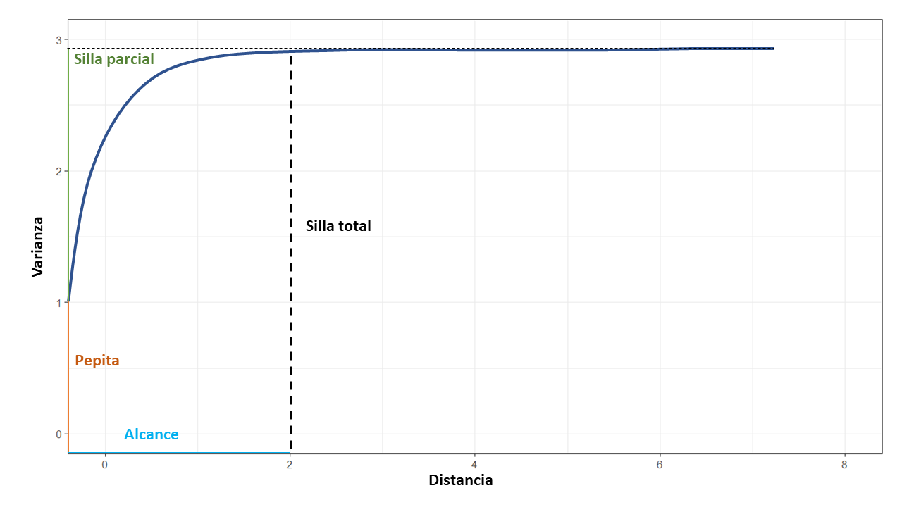
```

## Variograma

En la práctica, se trabaja con las realizaciones del proceso estocástico o campo aleatorio en estudio; es decir, se cuenta con un conjunto de datos georeferenciados en un dominio dado. Utilizando estos datos, se puede inferir la estructura de dependencia espacial del fenómeno [@montero].

Por lo general, la descripción de la distribución espacial se limita a los primeros momentos. La esperanza o el momento de primer orden involucra un solo sitio a la vez y no proporciona información sobre la dependencia espacial. Por otro lado, la covarianza, correlograma y variograma o momentos de segundo orden están definidos mediante un par ubicaciones; así, estos momentos proporcionan información de la continuidad y dependencia espacial de la variable regionalizada [@emery].

### Disimilitud contra Separación

La variabilidad de una variable regionalizada $Z(s)$, se mide en diferentes escalas y se calcula a través de la disimilitud entre los valores $z_{s1}$ y $z_{s2}$ ubicados en los puntos $s_1$ y $s_2$ del domino espacial $D$. La medida de disimilitud $\hat{\gamma}$ de estos valores está dada por:

```{=tex}
\begin{align*}
  \hat{\gamma}(s_1,s_2)=\frac{(z_{s1}-z_{s2})^2}{2}  
\end{align*}
```
Los dos puntos $s_1$ y $s_2$ en el espacio geográfico pueden unirse por un vector $\textbf{h}=s_1-s_2$ como se muestra en la Figura \@ref(fig:distanciah).


```{r distanciah, fig.cap="Distancia",echo=FALSE}
#options(knitr.graphics.auto_pdf = TRUE)
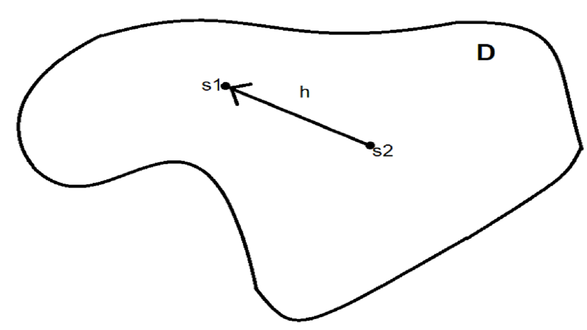
```

Si $\hat{\gamma}$ es dependiente de la separación y orientación del par de ubicaciones descritos por el vector $\textbf{h}$, se tiene que [@hans]:

```{=tex}
\begin{align*}
  \hat{\gamma}(h)=\frac{1}{2}(z(s_1+\textbf{h})-z(s_1))^2  
\end{align*}
```
La disimilitud es simétrica con respecto de $h$, pues es una cantidad al cuadrado, por lo que, su representación será mostrada utilizando todos los pares de datos de la muestra en el conjunto $D$. El gráfico de la disimilitud $\hat{\gamma}$ contra la separación espacial absoluta $h$, es llamado nube del variograma [@hans].

La disimilitud con frecuencia se incrementa con la distancia, pues los puntos cercanos tienden a ser similares [@hans] (ver Figura \@ref(fig:varcloud) ).


```{r varcloud, fig.cap="Disimilitud respecto de h.",echo=FALSE}
#options(knitr.graphics.auto_pdf = TRUE)
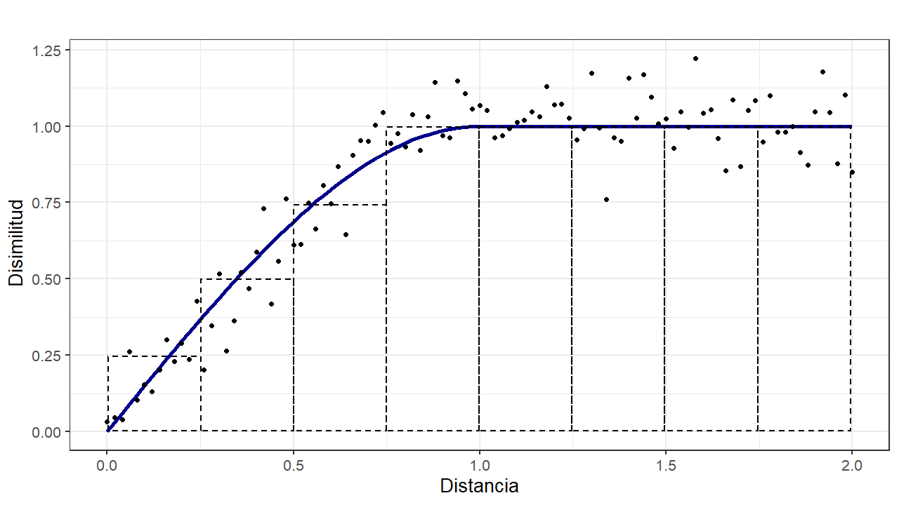
```

### Variograma Empírico

Teniendo en cuenta que el variograma $\gamma(\textbf{h})$ es la varianza de la variable de incrementos $Z(s+\textbf{h})-Z(s)$, el estimador clásico se basa en la estimación de esta varianza mediante el método de momentos y está definido para un vector de separación $\textbf{h}$ de la siguiente manera:

```{=tex}
\begin{align*}
  \hat{\gamma}(\textbf{h})=\frac{1}{2|N(\textbf{h})|}\sum_{N(\textbf{h})}(Z(s+\textbf{h})-Z(s))^2, \ \textbf{h}\in \mathbb{R}^d  
\end{align*}
```
donde:

```{=tex}
\begin{align*}
  N(\textbf{h})=\{(s_i,s_j):s_i-s_j=\textbf{h}, i,j=1,...,n\}  
\end{align*}
```
siendo $N(\textbf{h})$ el conjunto de todos los pares de ubicaciones cuya separación corresponde a un vector $\textbf{h}$ y $|N(\textbf{h})|$ es la cardinalidad de $N(\textbf{h})$. Nótese que $N(-\textbf{h})\neq N(\textbf{h})$, aunque $\hat{\gamma}(-\textbf{h})=\hat{\gamma}(\textbf{h})$, y la media $\mu$ no necesita ser estimada.

Al ser un estimador de la varianza muestral es sensible a datos atípicos; es por ello que [@Cressi] propuso estimadores resistentes a datos atípicos, asumiendo normalidad marginal del campo aleatorio [@marta]; sin embargo, la diferencia entre estos estimadores es pequeña [@Cressi].

#### Tolerancia en los parámetros de cálculo {.unnumbered}

En la práctica, los datos están distribuidos irregularmente en el dominio espacial $D$, por lo que el número de pares $|N(\textbf{h})|$ que se utilizan en el cálculo del variograma empírico, $\hat{\gamma}(\textbf{h})$ para un vector $\textbf{h}$ dado, es por lo general escaso; dando como resultado una estimación del variograma empírico errónea, provocando que sea imposible de interpretarlo y modelarlo. Para corregir esto, se suelen añadir algunas tolerancias de cálculo sobre las distancias y direcciones, teniendo así que:

```{=tex}
\begin{align*}
  \hat{\gamma^+}(\textbf{h})=\frac{1}{2|N^+(\textbf{h})|}\sum_{N^+(\textbf{h})}(Z(s+\textbf{h})-Z(s))^2  
\end{align*}
```
donde $N^+=\{(s_i,s_j): s_i-s_j\in T(\textbf{h})\}=\displaystyle \bigcup_{\textbf{h}^{'}\in T(\textbf{h})}N(\textbf{h}')$

Siendo $T(\textbf{h})$ una región de tolerancia alrededor de $\textbf{h}$; es decir, $T(\textbf{h})=[\textbf{h}-\Delta \textbf{h},\textbf{h}+\Delta \textbf{h}]$ en el caso unidiminesional. En el caso de dimensión dos o tres, existen tolerancias sobre la longitud de $\textbf{h}$ y sobre su orientación [@emery] (véase Figura \@ref(fig:regtol)):

```{r regtol, fig.cap="Región de tolerancia $T(\textbf{h})$ alrededor del vector $\textbf{h}$",echo=FALSE}
#options(knitr.graphics.auto_pdf = TRUE)
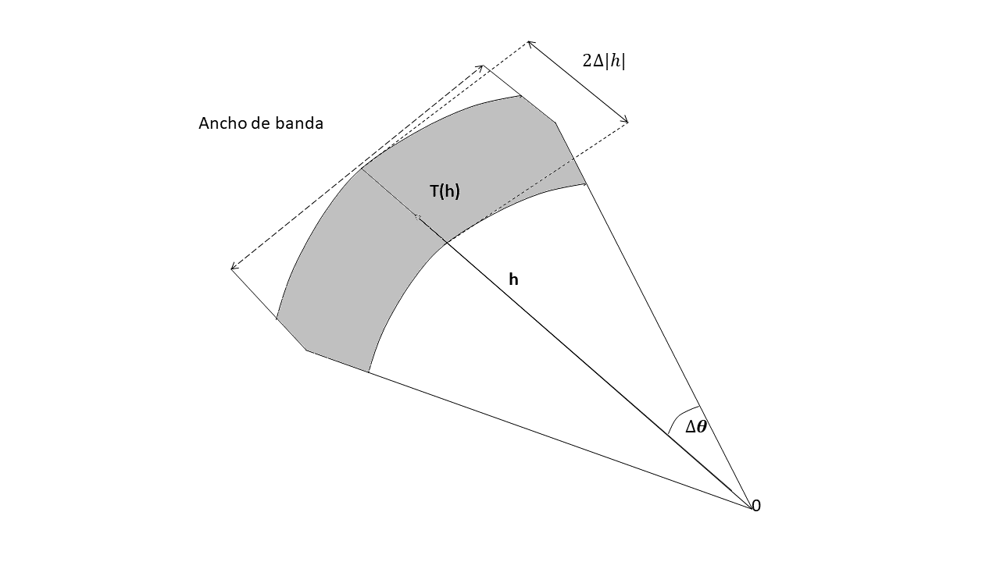
```

El ancho de banda limita la división del cono de tolerancia a una expansión máxima. En el espacio de tres dimensiones, se introducen dos anchos de banda, horizontal y vertical [@emery].

#### Propiedades del variograma empírico {.unnumbered}

-   El variograma empírico $\hat{\gamma}(\textbf{h})$ es un estimador insesgado del variograma teórico [@montero]:

    ```{=tex}
    \begin{align*}
        E(\hat{\gamma}(\textbf{h}))=\gamma(\textbf{h})  
      \end{align*}
    ```

-   La varianza relativa es un indicador de robustez:

    ```{=tex}
    \begin{align*}
        \frac{Var(\hat{\gamma}(\textbf{h}))}{(\gamma(\textbf{h}))^2}  
      \end{align*}
    ```
    A medida que más alta sea dicha varianza, más susceptible es el variograma empírico de fluctuar en torno a su valor esperado, y más difícil se vuelve la inferencia estadística.

    Los principales factores que influyen en la varianza relativa son [@emery]:

    -   Norma del vector $\textbf{h}$: la varianza relativa crece cuando la distancia aumenta.
    -   La irregularidad de la malla de muestreo, tiene la posibilidad de causar grandes variaciones en el cálculo del variograma empírico, incluso a distancias pequeñas.
    -   A medida que más reducido es el número de pares de datos, más grandes son las variaciones.
    -   La existencia de datos atípicos, puesto que en el cálculo del variograma empírico, se elevan los valores al cuadrado.

-   Las direcciones de cálculo del variograma empírico deben tener en consideración la anisotropía de la variable regionalizada; en la situación de isotropía, donde los variogramas direccionales son semejantes, se puede tener en cuenta un variograma omnidireccional, determinado por:

    ```{=tex}
    \begin{align*}
        \bar{\gamma}^+(h)=\frac{1}{2|N^+(\textbf{h})|}\sum_{N^+(\textbf{h})}(Z(s+\textbf{h})-Z(s))^2  
      \end{align*}
    ```
    donde: $|N^+(\textbf{h})|=\{(s_i,s_j): s_i-s_j \thickapprox \textbf{h}\}$ [@montero].

-   Si el variograma presenta comportamiento anisotrópico es necesario realizar transformaciones de las coordenadas que permitan obtener variables regionalizadas anistrópicas a partir de los modelos isotrópicos [@hans].

#### Nube variográfica {.unnumbered}

Teniendo presente que bajo el supuesto de estacionariedad, los valores $\hat{\gamma}(s_i,s_j)$ son estimadores insesgados de los valores que corresponden $\gamma(s_i,s_j)$. La recopilación de pares de distancias y sus correspondientes valores de variograma, $\{(\textbf{h},\gamma(\textbf{h})): \textbf{h}=s_i-s_j\}$, es conocido como variograma empírico y su gráfico como nube variográfica. Para mejorar la conducta del variograma empírico como un estimador del variograma teórico $\gamma(\textbf{h})$ es necesario aplicar un tipo de suavización, puesto que se espera que la función $\gamma(\textbf{h})$ varíe suavemente en función de $\textbf{h}$, por lo cual se disminuye la varianza sin añadir sesgo llevando a cabo un promedio de los valores de $\hat{\gamma}$ sobre rangos o \textit{bins} adecuados de distancia entre puntos $s_i,s_j$ [@peter].

Si el diseño de muestreo es una grilla regular la suavización puede ser lograda sin introducir sesgo, simplemente promediando todos los valores $\hat{\gamma}(\textbf{h})$ para cada $\textbf{h}$ diferente. Sin embargo, si el diseño es irregular, para un rango de ancho $m$ se define un variograma $\gamma_k$, para un entero positivo $k$, como el promedio de todos los $\hat{\gamma}(\textbf{h})$ para el cual la respectiva distancia $h$ satisfaga $(k-1)m<h\leq km$; entonces, $\gamma_k$ es aproximadamente una estimación insesgada de $\gamma(h_k)$; por conveniencia se adopta $h_k=(k-0.5)m$, que es el punto medio del intervalo respectivo [@peter].

```{r varcloud1, fig.cap="Nube variográfica",echo=FALSE}
#options(knitr.graphics.auto_pdf = TRUE)
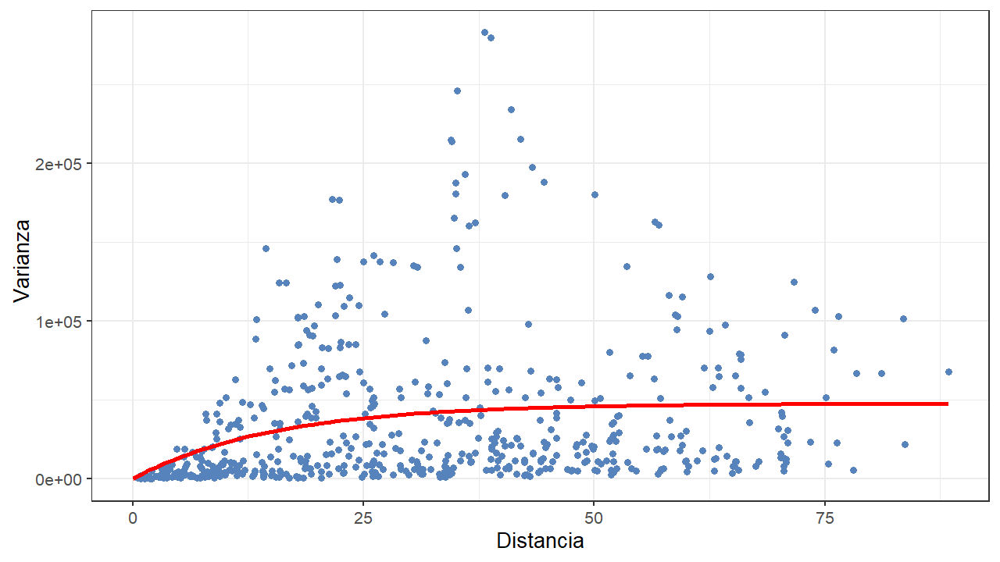
```
```{r varcloud2, fig.cap="Bin variograma",echo=FALSE}
#options(knitr.graphics.auto_pdf = TRUE)
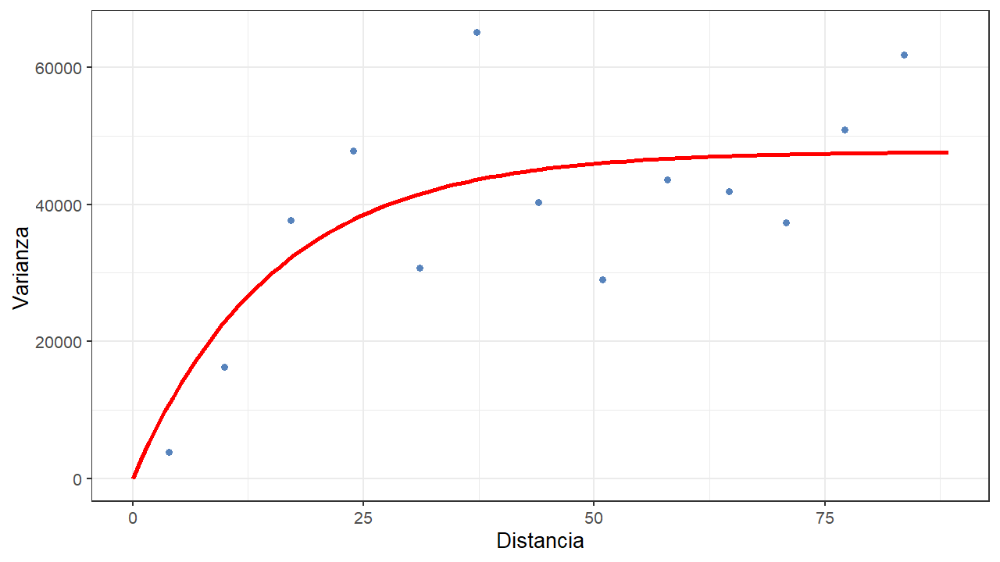
```
 

### Estimación del variograma (Ejemplos)\*

Se sabe que no se puede utilizar de manera directa el variograma emprírico, puesto que está definido para ciertas distancias y direcciones. Por otro lado, debido a los parámetros de tolerancia, está sujeto a aproximaciones, puesto que en el proceso de cálculo se utiliza un número limitado de datos. Para dar solución a esto, se ajusta un modelo teórico de variograma a partir del variograma empírico, siendo esta etapa la más significativa de todo análisis geoestadístico, puesto que nos da información de la continuidad espacial de la variable en estudio [@emery].

Una función de variograma teórico es ajustada a la sucesión de disimilitudes medias; nótese que este ajuste involucra una interpretación del comportamiento en el origen y el comportamiento para largas distancias, más allá del rango del variograma empírico. El ajuste puede llevarse a cabo de manera empírica mediante criterio experto, puesto que en la mayoría de casos prácticos no es fundamental el que tan bien la función de variograma se ajuste a la secuencia de puntos; lo más relevante es el tipo de continuidad que se asume para la variable regionalizada y la hipótesis de estacionariedad asociada al proceso estocástico espacial o campo aleatorio; estas suposiciones sirven de guía en la selección de una función de variograma teórico [@hans].

#### Comportamiento en el origen {.unnumbered}

Si las distancias son cercanas a cero; es decir, la variable regionalizada es regular en el espacio, más regular será el variograma en el origen. Generalmente, se suelen diferenciar tres tipos de comportamiento para el variograma en el origen (ver Figura \@ref(fig:varcomp)) [@emery]:

-   Parabólico: Corresponde a una variable regionalizada bastante regular en el espacio.

-   Lineal: Corresponde a una variable regionalizada continua, pero no tan regular.

-   Discontinuo: Corresponde a una variable regionalizada más errática; es decir, con discontinuidades en la distribución espacial de sus valores. La diferencia entre dos datos bastante cercanos es grande, lo que provoca el efecto pepita.

```{r varcomp, fig.cap="Comportamientos del variograma en el origen.",echo=FALSE}
#options(knitr.graphics.auto_pdf = TRUE)
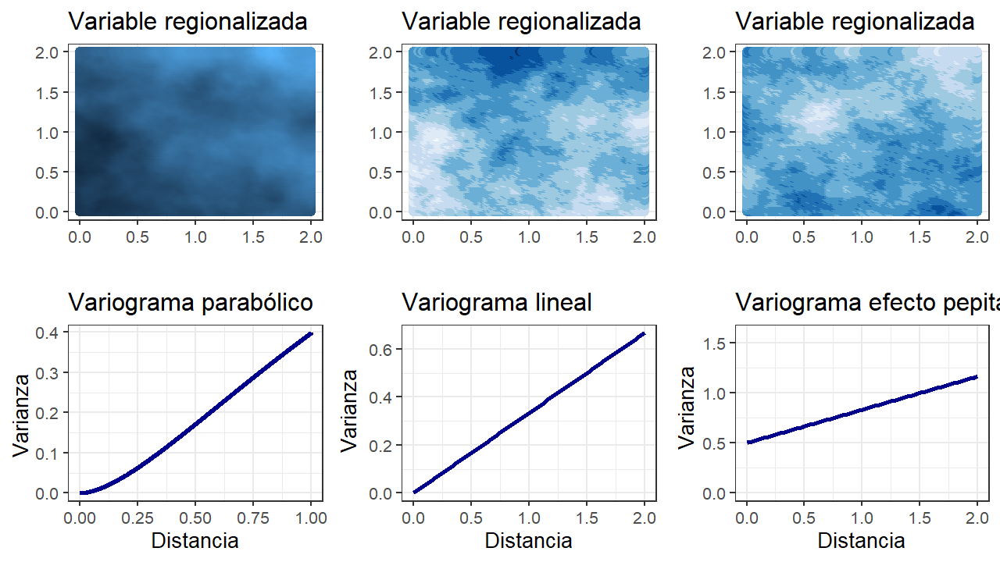
```

#### Comportamiento para distancias muy grades {.unnumbered}

El variograma habitualmente crece a partir del origen y se estabiliza a partir de una distancia $\phi$, alrededor de una silla $\sigma^2$; en este caso se conoce que esa silla es igual a la varianza a priori $C(0)=\sigma^2$.

Como se vio anteriormente, las variables aleatorias $Z(s)$ y $Z(s+\textbf{h})$ están correlacionadas, si la longitud del vector de separación $\textbf{h}$ es inferior a la distancia $\phi$ o alcance; más allá de $|h|=\phi$, el variograma es constante e igual a su silla, y las variables $Z(s)$ y $Z(s+\textbf{h})$ son independientes. Los variogramas con silla, se denominan \textit{modelos de transición} (ver Figura \@ref(fig:varsill)) [@emery].

```{r varsill, fig.cap="Lado izquierdo: Variograma con silla y alcance. Lado derecho: Variograma sin silla y  alcance.",echo=FALSE}
#options(knitr.graphics.auto_pdf = TRUE)
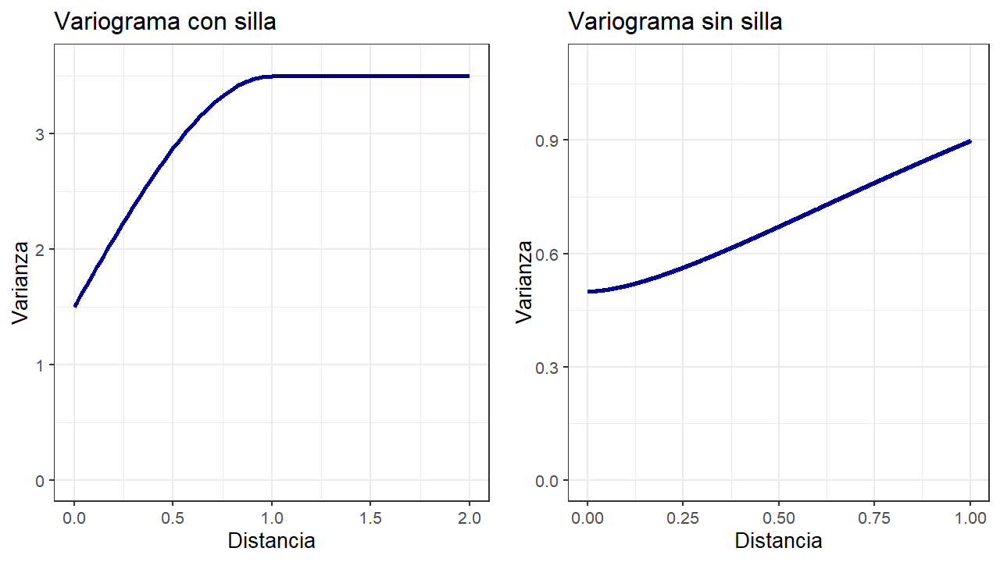
```

Existen casos en los cuales el variograma crece infinitamente una vez la distancia se incrementa y no posee ni silla ni rango; en este caso, la varianza es infinita $C(0)=\infty$ y no existe la función de covarianza ni el correlograma. Cuando se tiene ausencia de silla, es posible que sea una consecuencia del efecto de micro-escala [@emery].

### Criterios para la estimación y ajuste del variograma

#### Tendencia: {.unnumbered}

Es fundamental verificar que los datos no presenten tendencia, puesto que cuando la media del proceso $\mu(s)$ no es constante; es decir, el proceso no es estacionario, el variograma empírico calculado a partir de las observaciones es erróneo; este comportamiento de tendencia se puede comprobar mediante un gráfico de dispersión de la variable de respuesta frente a cada coordenada espacial (ver Figura \@ref(fig:coordtrend)). En caso de que se evidencie tendencia se sugiere que se incluya un modelo de superficie de tendencia para la media que varía espacialmente, cuando una superficie de tendencia es incluida en el modelo, las dos coordenadas espaciales deben contribuir en este, puesto que la orientación de la región de estudio es arbitraria. En la práctica; al trabajar con datos geográficos de gran escala, se puede esperar que ciertas variables relacionadas a un ambiente físico muestren dependencia en la latitud [@peter].


```{r coordtrend, echo=FALSE, fig.cap="Tendencia"}
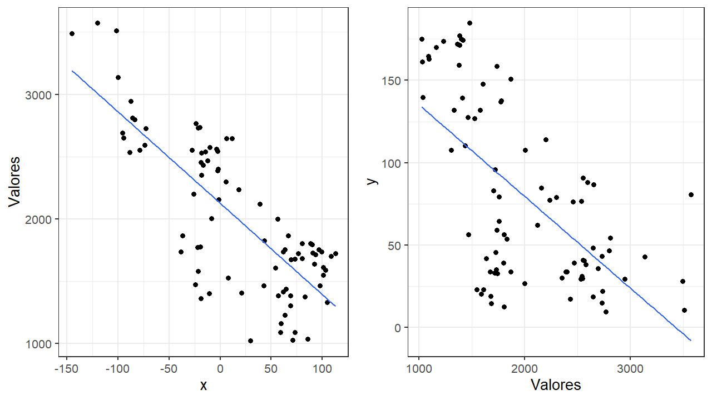
```
Cuando la función de media no es constante, el variograma empírico atribuye de manera errónea la variación inducida por esta a la estructura de convarianza de gran escala en el proceso no observado $Z(s)$. Una solución es estimar $\mu(s)$ mediante un modelo de superficie de tendencia o, si la información de la covariable está disponible, mediante un modelo general de regresión, y utilizar los residuos $R_i=Z_i-\hat{\mu}(s_i)$ en lugar de las observaciones para el cálculo del variograma empírico [@peter]. Este comportamiento se puede visualizar en la Figura \@ref(fig:rcoordtrend).

```{r rcoordtrend, echo=FALSE, fig.cap="Tendencia"}
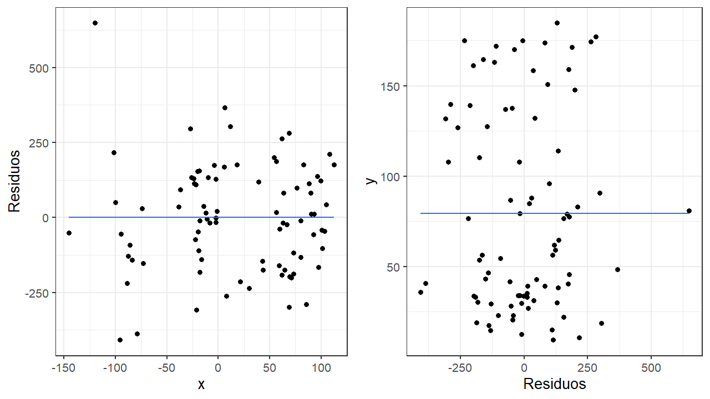
```

#### Establecer la variable correcta: {.unnumbered}

En la estimación del variograma influye la distribución de los datos, pues estos pueden estar sesgados o tener valores extremos altos o bajos y por tanto su variograma calculado suele presentar un comportamiento errático. Para abordar este problema es recomendable transformar los datos a un espacio Normal o Gaussiano [@garten]. Ver Figura \@ref(fig:denvar).

```{r denvar, echo=FALSE, fig.cap="Arriba: Variograma empírico calculado a partir de los datos originales. Abajo: Variograma empírico calculado a partir de los residuos."}
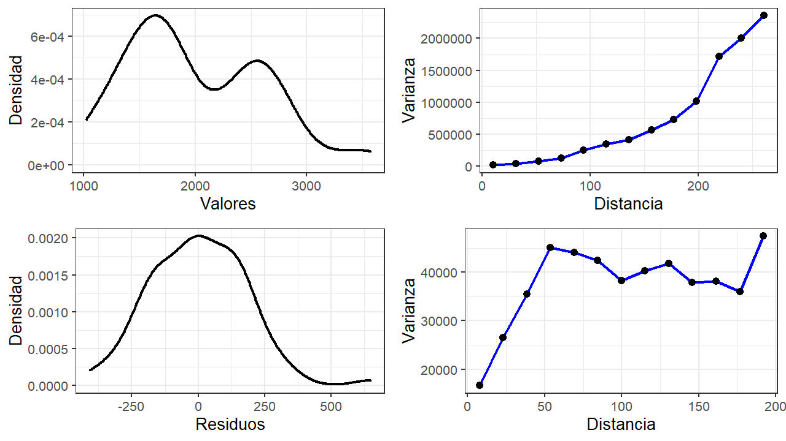
```
#### Verificación de isotropía: {.unnumbered}

Como bien se conoce, se debe verificar la estacionariedad de los datos, puesto que este influye de manera directa en la estimación del variograma empírico; teniendo en cuenta que un proceso espacial puede estar definido en varias direcciones, este criterio se debe verificar para todas estas. No obstante, en la práctica la isotropía se estudia por medio del cálculo de funciones de autocovariaza o de semivarianza muestrales en algunas direcciones que habitualmente son: $0^o,45^o, 90^o$ y $135^o$, ver Figura. \@ref(fig:isodir).


```{r isodir, echo=FALSE, fig.cap="Comportamiento", fig.height=5, fig.width=10}
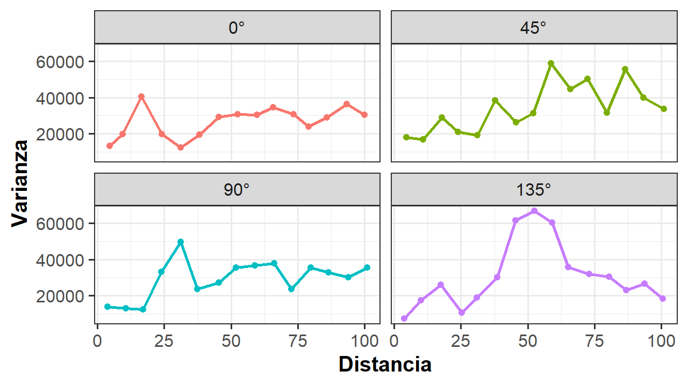
```
Con la verificación de los puntos anteriores, se procede al cálculo del variograma empírico y su posterior ajuste de un modelo teórico por medio de los métodos que se exponen a continuación.

### Métodos de estimación teórica más utilizados

Los parámetros de la función de covarianza pueden ser estimados por medio de los métodos de Máxima Verosimilitud (ML) y Máxima Verosimilitud restringida (REML), los cuales requieren la especificación de la distribución del vector $Z=(Z(s_1),...,Z(s_n))$; generalmente, se asume normalidad multivariada. Para el caso ML, se tiene que:

```{=tex}
\begin{align*}
  Z\sim N_n(X\beta,\Sigma(\theta))  
\end{align*}
```
donde $\Sigma(\theta)=Cov(Z)$ es una matriz de dimensión $n \times n$ y $X$ es una matriz de dimensión $n\times q$ con $q<n$, de variables explicativas, dentro de las cuales comúnmente se encuentran las coordenadas geográficas; de donde el negativo de la función de logverosimil es:

```{=tex}
\begin{align*}
   L(\beta,\theta)=\frac{n}{2}\log(2\pi)+\frac{1}{2} \log|\Sigma(\theta|)+\frac{1}{2}(Z-X\beta)'\Sigma^{-1}(\theta)(Z-X\beta) 
\end{align*}
```
El elemento $i,j$ de la matriz $\Sigma(\theta)$ corresponde a la covarianza espacial entre las variables $Z(s_i)$ y $Z(s_j)$; esto es:

```{=tex}
\begin{align*}
  Cov(Z(s_i),Z(s_j);\theta))=C(s_i-s_j;\theta)=C(\textbf{h};\theta)  
\end{align*}
```
El estimador $\hat{\theta}$ es sesgado pero asintóticamente eficiente; no obstante, al trabajar con una muestra grande se debe tener en consideración que debido a su conducta iterativa, se realizarán grandes cantidades de operaciones computacionales debido al cálculo del determinante y de la inversa de la matriz de covarianza [@marta].

#### Estimador REML {.unnumbered}

El estimador REML es una modificación del estimador ML propuesto para disminuir el sesgo, el cual reemplaza la maximización de la verosimilitud del vector $Z$, por la del vector $A'Z$ tal que: $E(A'Z)=0$, donde $A$ es una matriz de dimensión $n\ \text{x}\ (n-p)$, de rango columna completo.

Con esta modificación y dado que \begin{align*}
  Var(A'Z)=A'\Sigma(\theta)A  
\end{align*}

el negativo de la función de logverosímil queda:

```{=tex}
\begin{align*}
   L(\theta)=\frac{n}{2}\log(2\pi)+\frac{1}{2} \log|A'\Sigma(\theta) A|+\frac{1}{2}Z'(A'\Sigma(\theta) A)^{-1} A'Z 
\end{align*}
```
Esta función es dependiente únicamente de $\theta$; de esta manera este método no usa la modelización de la superficie de tendencia, sino que se basa directamente en un vector de incrementos de media 0. No obstante, pese a minimizar el sesgo en las estimaciones de $\theta$, aun interviene un costo computacional elevado [@marta].

#### Verosimilitud Compuesta (CL) {.unnumbered}

El método CL que se utiliza para estimar $\theta$, involucra la suma de componentes individuales de funciones logverosimilitud, correspondiente a las distribuciones marginales de las variables de interés. Por consiguiente, la distribución multivariada de $Z$ no es necesaria, puesto que se basa en las distribuciones marginales $f(Z(s_i);\theta)$ y se asume la existencia del gradiente y de la matriz Hessiana de $f$.

Ahora bien, se suponen conocidas $f(Z(s_i);\theta)$, excepto el parámetro $\theta$; entonces:

```{=tex}
\begin{align*}
  \log(Z(s_i);\theta)=\ln(f(Z(s_i);\theta))  
\end{align*}
```
es una función logverosímil y la función de verosimilitud compuesta está definida por:

```{=tex}
\begin{align*}
   CL(\theta)=\sum_{i=1}^{n} \log(Z(s_i);\theta)  
\end{align*}
```
Al gradiente de CL, $\nabla CL=CS(\theta)$, se le conoce como función de score compuesta.

Así, los valores estimados de $\hat{\theta}$ se determinan resolviendo el siguiente sistema de ecuaciones:

```{=tex}
\begin{align*}
   CS(\theta)=\sum_{i=1}^{n} \nabla\log(Z(s_i);\theta)=0  
\end{align*}
```
Una de las razones principales para usar las funciones de verosimilitudes marginales es que aunque al inicio no se cumpla el supuesto requerido, es posible aproximarse a este por medio de alguna transformación [@marta].

#### Mínimos cuadrados ponderados {.unnumbered}

Este método utiliza la matriz de ponderación $W(\theta)$ y suele ser expresado en términos del variograma o de la covarianza, gracias a su equivalencia en procesos estacionarios de segundo orden. Para el caso espacio-temporal, se estima $\theta$ para un variograma minimizando la siguiente expresión:

```{=tex}
\begin{align*}
  (2\hat{\gamma}-2\gamma(\theta))'W^{-1}(\theta)(2\hat{\gamma}-2\gamma(\theta))  
\end{align*}
```
donde la matriz de ponderación $W(\theta)$ está dada por:

```{=tex}
\begin{align*}
  W(\theta)=Diag(Var(2\hat{\gamma}(\textbf{h}_k)))\approx Diag\left(\frac{2(2\gamma(\textbf{h}_k|\theta))^2}{N(\textbf{h}_k)}\right)  
\end{align*}
```
con:

```{=tex}
\begin{align*}
  N(\textbf{h}_k)=\{(i,j):s_i-s_j=\textbf{h}_k\}  
\end{align*}
```
Para las ubicaciones $i,j=1,...,n$, que producen los primeros $k$ rezagos espaciales $k=1,...,K$; generalmente se utilizan los rezagos espaciales hasta la mitad de la distancia máxima entre cualquier par de ubicaciones, debido a que para ubicaciones bastante separadas disminuye notoriamente la cantidad de puntos incluidos en la estimación del variograma. La aproximación de $Var(2\hat{\gamma}(\textbf{h}_k|\theta))$, se obtiene bajo el supuesto de que $Z(s)\sim N(\mu;\sigma^2), \forall s\in \mathbb{R}^d$, y que por consiguiente:

```{=tex}
\begin{align*}
  (Z(s+\textbf{h})-Z(s))^2\approx 2\gamma(\textbf{h})\chi_1^2   
\end{align*}
```
El inconveniente que presenta este método es la necesidad de definir clases de rezagos para realizar una estimación empírica de la covarianza o del variograma, pues si no se poseen muchos datos la cantidad de estos en cada una de las clases disminuye, de tal forma que para los primeros rezagos se pueden tener suficientes datos para la estimación de cada $\hat{\gamma}(\textbf{h}_k)$; sin embargo, para los últimos rezagos podrían no existir suficientes datos para la estimación [@marta].

#### Modelo lineal de regionalización {.unnumbered}

En la práctica, puede suceder que el variograma empírico no presente una apariencia o forma simple de ser modelizado por un modelo teórico; no obstante, esto no es un inconveniente, puesto que existe la posibilidad de combinar modelos teóricos de variograma, obteniendo nuevos modelos más complejos.

Teniendo presente que un fenómeno regionalizado podría ser considerado como la suma de diversos subfenómenos independientes, el modelo lineal de regionalización construye un campo aleatorio $Z(s)$ como una combinación lineal de $L$ campos aleatorios independientes, cada uno con media 0 y función de covarianza $C_l(h)$, mutuamente independientes [@marta].

Así, sea $Y_l$ un subcampo aleatorio de $Z$ para todo $l=1,...,L$, se tiene que:

```{=tex}
\begin{align*}
  Z(s)=\sum_{l=0}^{L}a_lY_l(s)+\mu
\end{align*}
```
con:

```{=tex}
\begin{align*}
    E(Z(s))&=\mu\\
    E(Y_l(s))&=0\\
    Cov(Y_l(s),Y_{l'}(s+\textbf{h}))&= \left \{ \begin{matrix} C_l(h) & si \ l=l'
\\ 0 & en\ otro\ caso.
\end{matrix}\right.  
\end{align*}
```
Esto implica que la función de covarianza de $Z(s)$ es una combinación lineal de las $L$ funciones $C_l(h)$ y bajo el supuesto de independencia entre los $Y$, se tiene que:

```{=tex}
\begin{align*}
    C(h)&=Cov(Z(s),Z(s+\textbf{h}))\\
    &= \sum_{l=0}^L\sum_{l'=0}^L Cov((Y_l(s),Y_{l'}(s+\textbf{h}))) \\
    &=\sum_{l=0}^La_la_lC_l(h)\\
    &=\sum_{l=0}^La_l^2C_l(h)
\end{align*}
```
por lo tanto, el modelo de convarianza $C(h)$ es:

```{=tex}
\begin{align*}
  C(h)=\sum_{l=0}^Lb_lC_l(h),\ con\ b_l=a_l^2\geq 0  
\end{align*}
```
De esta forma, como $b_l>0$ es siempre positivo, y es la silla del modelo básico de covarianza $C_l(h)$. Las condiciones suficientes para que $C(h)$ sea un modelo válido de covarianza son:

-   Las funciones $C_l(h)$ son modelos de convarianza válidos.
-   $b_l>0,\ \forall_l=1,...,L$

En términos de variogramas, se tiene que:

```{=tex}
\begin{align*}
  E\left[ (Y_l(s)-Y_l(s+\textbf{h}))(Y_{l'}(s)-Y_{l'}(s+\textbf{h}))  \right]=\left \{ \begin{matrix} \gamma'_l(h) & si\ l=l'\\ 
0 & en\ otro\ caso. 
\end{matrix}\right.    
\end{align*}
```
Entonces,

```{=tex}
\begin{align*}
   \gamma(h)=\frac{1}{2} E[Z(s+\textbf{h})-Z(s)]^2=\sum_{l=0}^Lb_l\gamma'_l(h) 
\end{align*}
```
con $b_l=(a_l)^2\geq 0$, donde $b_l$ es la contribución en varianza del correspondiente variograma $\gamma'_l(h)$ [@marta].

**GRAFICOSY EJEMPLOS**

### Modelos teóricos de variograma

En esta sección se presentan las funciones de variograma más comunes, que se definen para el caso isotrópico de funciones aleatorias. Para la representación gráfica de la función de variograma se hace uso de la relación $\gamma(h)=C(0)-C(h)$. Estas funciones se pueden clasificar de la siguiente manera:

-   Variogramas con silla o variogramas de transición.
-   Variogramas con silla y efecto hueco.
-   Variogramas sin silla.

#### Variogramas con silla {.unnumbered}

**Modelo esférico**

Este modelo es válido solo en $\mathbb{R}^1,\mathbb{R}^2,\mathbb{R}^3$, y está definido por:

```{=tex}
\begin{align*}
    \gamma(||\textbf{h}||;\theta) = \left \{ \begin{matrix} \sigma^2\left(1.5\frac{||\textbf{h}||}{\phi}-0.5\left(\frac{||\textbf{h}||}{\phi}\right)^3 \right) &  si \ ||\textbf{h}||\leq \phi
\\ \sigma^2 &  si\ ||\textbf{h}||>\phi \end{matrix}\right. 
\end{align*}
```
con $\theta=(\sigma^2,\phi)$, donde $\sigma^2=C(0)$ es el valor del variograma donde alcanza la silla, y $\phi$ es el rango.\\

Este variograma presenta un comportamiento lineal cerca del origen, lo cual sugiere continuidad pero con cierto grado de irregularidad en el proceso estocástico espacial o campo aleatorio. Sin embargo, referente a su comportamiento en distancias largas, alcanza su silla en $||\textbf{h}||=\phi$. El uso habitual de este modelo en la práctica es gracias a su rango bien definido, su representación polinomial simple y su validez en $\mathbb{R}^1,\mathbb{R}^2,\mathbb{R}^3$. La principal razón para el uso de este es que se comporta de forma casi lineal hasta que alcanza su silla, y presenta estabilidad en una gran variedad de observaciones.


```{r sphvar, echo=FALSE, fig.cap="Izquierda: Variable regionalizada. Derecha: Variograma esférico.", fig.height=5, fig.width=10}
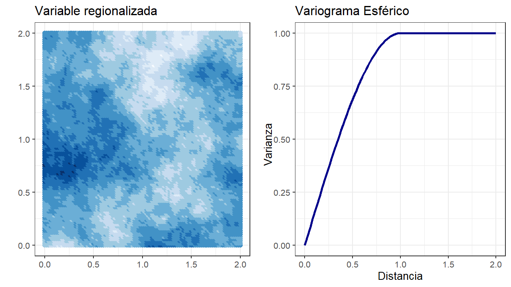
```
**Modelo de efecto pepita puro**

Este variograma refleja la ausencia de dependencia espacial en el proceso estocástico o campo aleatorio; este modelo puede ser visto como un caso particular del modelo esférico si $\phi \to 0$:

```{=tex}
\begin{align*}        
    \gamma(||\textbf{h}||;\theta) = \left \{ \begin{matrix} \sigma^2&  si \ ||\textbf{h}|| =0\\
    0 &  si\ ||\textbf{h}||>0 \end{matrix}\right.
    \end{align*}
```
con $\theta=\sigma^2$.

Se debe tener en cuenta que el modelo esférico corresponde a una función aleatoria continua, mientras que el modelo de efecto pepita puro, a una discontinuidad.


```{r  echo=FALSE, fig.cap="Izquierda: Variable regionalizada. Derecha: Variograma pepita puro.", fig.height=5, fig.width=10}
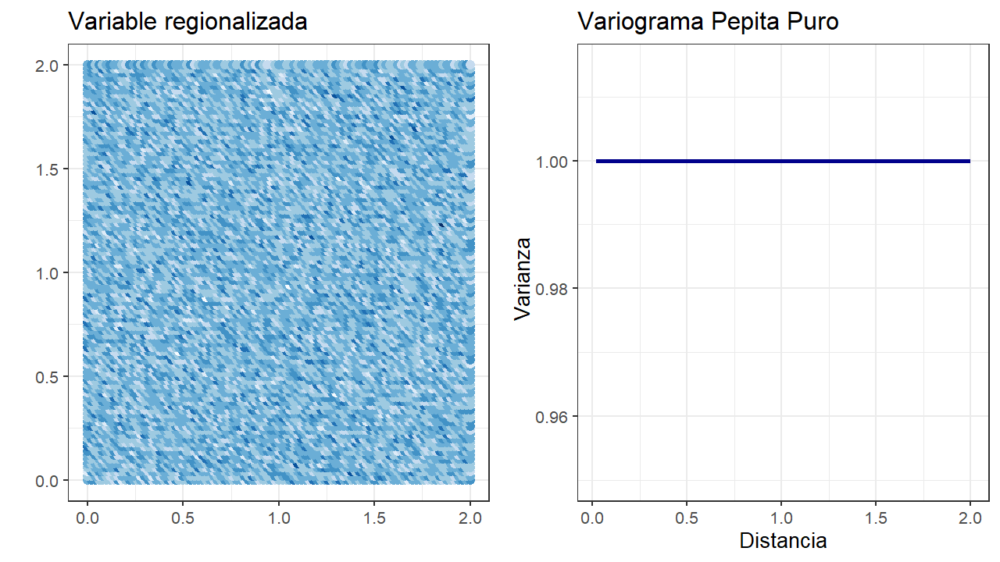
```
**Modelo exponencial**

Este modelo es válido en $\mathbb{R}^d,\ d\geq 1$, y está definido por:

```{=tex}
\begin{align*}
    \gamma(||\textbf{h}||;\theta)=\sigma^2 \left(1-\exp\left(-\frac{||\textbf{h}||}{\phi}\right) \right),\quad \theta=(\sigma^2,\phi)
\end{align*}
```
El modelo exponencial refleja un comportamiento lineal cerca del origen, lo cual indica continuidad pero con un cierto grado de irregularidad en la función aleatoria. Por otro lado, en cuanto a su comportamiento en largas distancias, este alcanza su silla solo asintóticamente cuando $||\textbf{h}||\to \infty$. El valor del rango es igual a la distancia para el cual el variograma toma un valor igual al $95\%$ de la silla.

```{r  echo=FALSE, fig.cap="Izquierda: Variable regionalizada. Derecha: Variograma exponencial.", fig.height=5, fig.width=10}
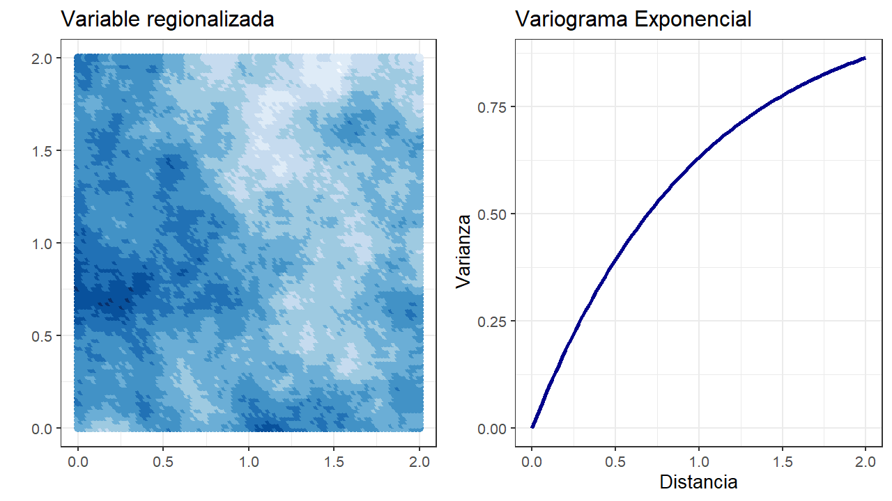
```
**Modelo Gaussiano**

Este modelo es válido en $\mathbb{R}^d,\ d\geq 1$, y está definido por:

```{=tex}
\begin{align*}
    \gamma(||\textbf{h}||;\theta)=\sigma^2\left(1-\exp\left(-\frac{||\textbf{h}||^2}{\phi^2} \right) \right),\quad \theta=(\sigma^2,\phi)
\end{align*}
```
La principal característica de este modelo es su forma parabólica cerca al origen; la dependencia espacial se desvanece solo en una distancia que tiende a infinito; por consiguiente, este modelo es considerado poco realista en la práctica.


```{r gauvar, echo=FALSE, fig.cap="Izquierda: Variable regionalizada. Derecha: Variograma Gaussiano.", fig.height=5, fig.width=10}
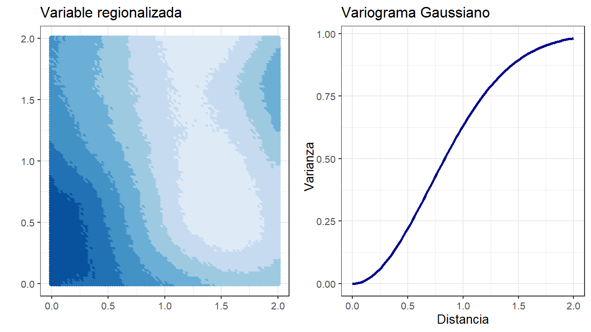
```
**Modelo Cúbico**

Este modelo es válido en $\mathbb{R}^1,\mathbb{R}^2,\mathbb{R}^3$; generalmente es similar al modelo Gaussiano, puesto que también presenta un comportamiento parabólico cerca del origen. Sin embargo, este modelo alcanza una silla plana a una distancia $\phi$, y esta definido por:

```{=tex}
\begin{align*}
    \gamma(||\textbf{h}||;\theta)=\left \{ \begin{matrix} \sigma^2\left(7\frac{||\textbf{h}||^2}{\phi^2}-\frac{35||\textbf{h}||^3}{4\phi^3}+\frac{7||\textbf{h}||^5}{2\phi^5}-\frac{3||\textbf{h}||^7}{4\phi^7} \right) &  si \ 0\leq||\textbf{h}||\leq\phi\\
    \sigma^2 &  si\ ||\textbf{h}||>\phi \end{matrix}\right.
\end{align*}
```
con $\theta=(\sigma^2,\phi)$.


```{r cubvar, echo=FALSE, fig.cap="Izquierda: Variable regionalizada. Derecha: Variograma cúbico.", fig.height=5, fig.width=10}
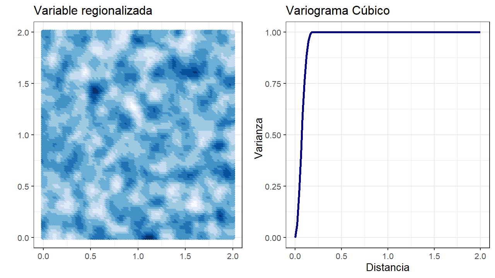
```
**Modelo Estable**

Este modelo es válido en $\mathbb{R}^d,\ d\geq1$ y está definido por:

```{=tex}
\begin{align*}
    \gamma(||\textbf{h}||;\theta)=\sigma^2 \left(1-\exp\left(-\left(\frac{||\textbf{h}||}{\phi}\right)^\alpha\right) \right),\quad 0<\alpha \leq 2,\ \theta=(\sigma^2,\phi)
\end{align*}
```
Notar que para $\alpha=1$, se obtiene el modelo exponencial y con $\alpha=2$, se convierte en un modelo Gaussiano.


```{r establevar, echo=FALSE, fig.cap="Izquierda: Variable regionalizada. Derecha: Variograma estable.", fig.height=5, fig.width=10}
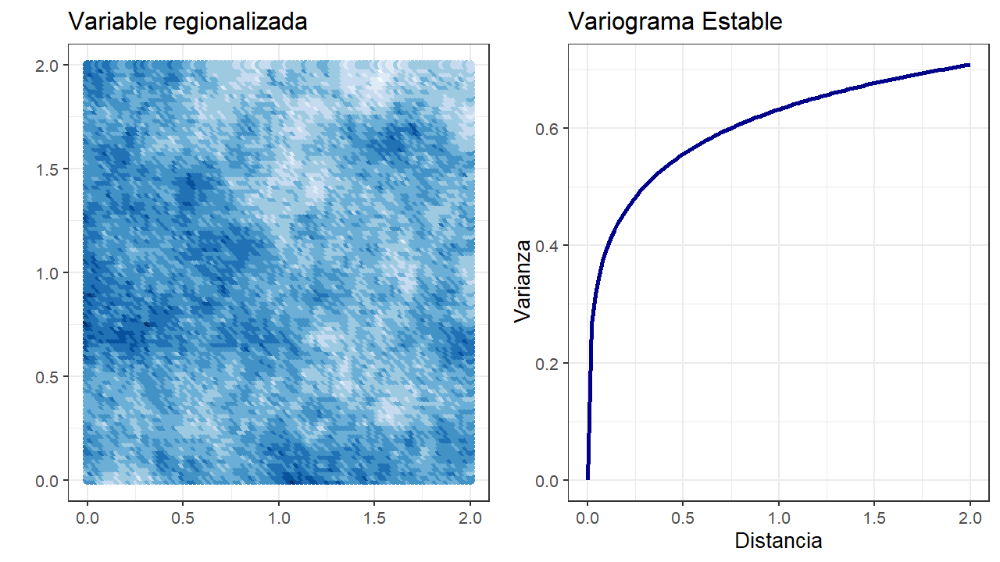
```
**Modelo de Cauchy Generalizado**

Este modelo es válido en $\mathbb{R}^d,\ d\geq1$, y está definido por:

```{=tex}
\begin{align*}
    \gamma(||\textbf{h}||;\theta)=\sigma^2\left(1-\frac{1}{\left(1+\left( \frac{||\textbf{h}||}{\phi} \right)^2\right)^\alpha} \right), \quad \theta=(\sigma^2,\phi)
\end{align*}
```
Si $\alpha=1$ es conocido como el modelo de Cauchy.

Este modelo muestra un comportamiento parabólico cerca del origen y si $\alpha<2$ alcanza la silla lentamente.


```{r caugenvar, echo=FALSE, fig.cap="Izquierda: Variable regionalizada. Derecha: Variograma Cauchy generalizado.", fig.height=5, fig.width=10}
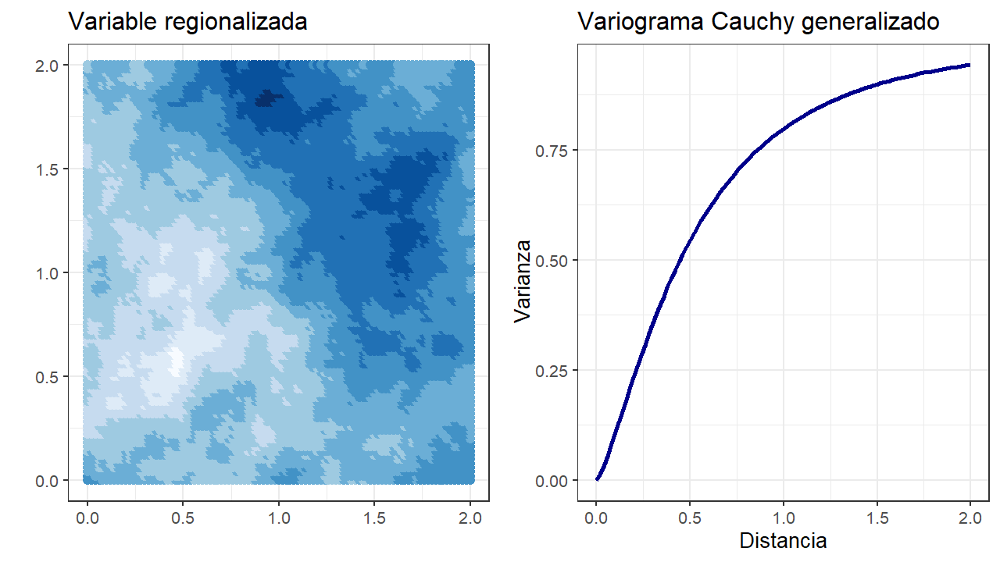
```
**Modelo de K-Bessel o Matérn**

Este modelo es válido en $\mathbb{R}^d,\quad d \geq 1$, y esta definido por:

```{=tex}
\begin{align*}
    \gamma(||\textbf{h}||;\theta)=\sigma^2\left(1-\frac{1}{2^{\alpha-1}\Gamma(\alpha)}\left(\frac{||\textbf{h}||}{\phi} \right)^\alpha K_\alpha \left(\frac{||\textbf{h}||}{\phi} \right) \right),\quad \alpha>0,\ \theta=(\sigma^2,\phi)
\end{align*}
```
donde $K_\alpha$ es la función de Bessel modificada de segundo tipo de orden $\alpha$, y que está definida por:

```{=tex}
\begin{align*}
    K_\alpha (\nu) =\frac{\pi}{2\sin(\alpha \pi)}\left(\sum_{k=0}^\infty {\frac{1}{k!\Gamma(-\alpha+k+1)}\left(\frac{\nu}{2}\right)^{2k-\alpha}}-\sum_{k=0}^\infty {\frac{1}{k!\Gamma(\alpha+k+1)}\left(\frac{\nu}{2}\right)^{2k+\alpha}}\right)
\end{align*}
```
El modelo K-Bessel puede tener cualquier tipo de comportamiento cerca del origen. Para $\alpha=1/2$, se obtiene el modelo exponencial.


```{r matvar, echo=FALSE, fig.cap="Izquierda: Variable regionalizada. Derecha: Variograma Matérn.", fig.height=5, fig.width=10}
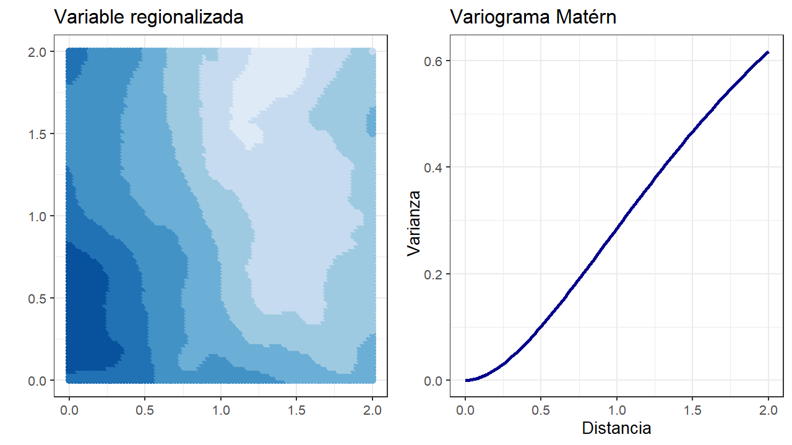
```
#### Variogramas con efecto hueco {.unnumbered}

En la práctica la dependencia espacial puede no crecer monótonamente, incluso esta podría ser negativa o presentar alternaciones entre dependencia espacial positiva y negativa. Estos modelos se llaman \textit{modelos de efecto hueco} y se utilizan para definir oscilaciones que involucran un significado físico. Presentan un comportamiento lineal o parabólico cerca del origen, pueden tener o no tener silla, y pueden ser o no periódicos o pseduperiódicos.

**Modelo J-Bessel**

Este modelo está definido por:

```{=tex}
\begin{align*}
    \gamma(||\textbf{h}||;\theta)=\sigma^2\left(1-\left(\frac{2\phi}{||\textbf{h}||} \right)^{\alpha} \Gamma(\alpha+1)J_\alpha \left(\frac{||\textbf{h}||}{\phi} \right) \right),\quad \theta=(\sigma^2,\phi)
\end{align*}
```
donde $\alpha$ es el parámetro de forma, $\phi$ es el parámetro de escala, $\Gamma$ es la función de Euler, y $J_\alpha$ es la función $J-Bessel$ del primer tipo de orden $\alpha$ dada por:

```{=tex}
\begin{align*}
    J_\alpha (\nu) =\left(\frac{\nu}{2}\right)^2 \sum_{k=0}^\infty{{\frac{-1^k}{k!\Gamma(\alpha+k+1)}}{\left(\frac{\nu}{2}\right)^{2k}}}
\end{align*}
```
y es válido para $\mathbb{R}^d, d\leq 2(\alpha+1)$.\\


```{r besvar, echo=FALSE, fig.cap="Izquierda: Variable regionalizada. Derecha: Variograma J-Bessel.", fig.height=5, fig.width=10}
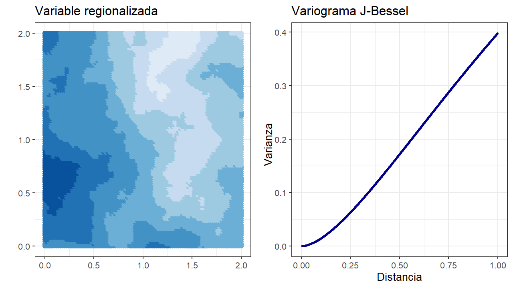
```
**Modelo seno cardinal**

Este modelo es una particularización del modelo J-Bessel para $\alpha=1/2$, y es uno de los pocos modelos de efecto hueco válidos en $\mathbb{R}^3$, y está definido por:

```{=tex}
\begin{align*}
    \gamma(||\textbf{h}||;\theta)=\sigma^2 \left(1-\frac{\phi}{||\textbf{h}||}\sin\left(\frac{||\textbf{h}||}{\phi} \right)  \right),\quad \theta=(\sigma^2,\phi)
\end{align*}
```

```{r sinvar, echo=FALSE, fig.cap="Izquierda: Variable regionalizada. Derecha: Variograma seno cardinal.", fig.height=5, fig.width=10}
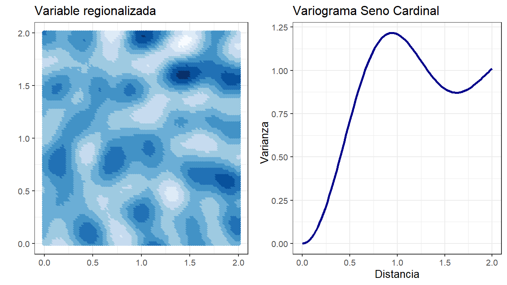
```
#### Variogramas sin silla {.unnumbered}

Estos modelos corresponden a procesos estocásticos espaciales o campos aleatorios que son intrínsecamente estacionarios, pero no son estacionarios de segundo orden. Estos modelos son no acotados y corresponden a un proceso estocástico espacial o campo aleatorio con capacidad ilimitada para la dispersión espacial y, por consiguiente, ni su covarianza, ni su varianza pueden ser definidas.

**Modelo Potencia**

Este modelo es válido en $\mathbb{R}^d,d\geq 1$ y está definido por:

$$
          \gamma(||\textbf{h}||)=(||\textbf{h}||)^\alpha,\quad  0<\alpha<2, 
$$

Este variograma no posee ni silla ni rango, sino que crece indefinidamente. Si $\alpha$ es cercano a cero, se dice que es un variograma de efecto pepita, si $\alpha$ es cercano a dos tiene un comportamiento parabólico y si $\alpha$ es igual a uno presenta un comportamiento lineal. Para $\alpha\geq 2$ la condición $\lim_{h\to \infty}\frac{\gamma||\textbf{h}||}{h^2}=0$ no se satisface; es decir, el modelo no es intrínsecamente estacionario.

**Modelo lineal**

Este modelo es un caso especial del modelo potencia si $\alpha=1$, y está asociado con la estacionariedad intrínseca, pero no con la estacionariedad de segundo orden y está definido por:

$$
          \gamma(||\textbf{h}||)=\left \{ \begin{matrix} 0 & si\ ||\textbf{h}||=0\\ ||\textbf{h}|| & si\ ||\textbf{h}||>0 \end{matrix}\right.  
$$

### Caso Multivariante (Ejemplos)

El variograma multivariado fue formalizado en 1991 como una aplicación a procesos estocásticos espaciales o campos aleatorios estacionarios. Para un vector de $p$ variables regionalizadas estacionarias y para toda métrica $M$, el covariograma multivariado y el variograma multivariado son definidos como:

-   Covariograma multivariado:

    ```{=latex}
    \begin{align*}
          K(h)&=E[(Z(s)-\boldsymbol \mu)M(Z(s+\textbf{h})-\boldsymbol \mu){'}]
      \end{align*}
    ```

-   Variograma multivariado:

    ```{=tex}
    \begin{align*}
          \Gamma(h)=E[(Z(s)-Z(s+\textbf{h}))M(Z(s)-Z(s+\textbf{h}))']
      \end{align*}
    ```

donde $Z(s)$ es un vector fila de $p$ procesos estocásticos espaciales o campos aleatorios estacionarios de segundo orden, $\boldsymbol \mu=E[Z(s)]$ y $M$ es una matriz simétrica definida positiva de tamaño $p\times p$ utilizada como métrica en el cálculo de similaridades [@borou].

Asumiendo estacionariedad de segundo orden, la función de autocovarianza multivariada está relacionada con el variograma multivariado por medio de:

```{=tex}
\begin{align*}
    K(h)=\Gamma(\infty)-\Gamma(h)
\end{align*}
```
donde $\Gamma(\infty)$ es la silla del variograma multivariado. Si $\Gamma(0)=0$ entonces $K(0)=\Gamma(h)$.

El variograma multivariado representa la esperanza matemática de una medida de disimilitud cuadrática, y la función de autocovarianza multivariada representa la esperanza matemática de una medida de similaridad multivariante [@borou].

La estimación del variograma multivariado se realiza promediando las disimilitudes multivariadas al cuadrado, de forma similar al variograma tradicional; es decir:

```{=tex}
\begin{align*}
    \Gamma^*(h)=\frac{1}{2|N(\textbf{h})|}\sum_{N(\textbf{h})}d_{ij}^2
\end{align*}
```
donde $d_{ij}$ es la disimilitud entre las muestras $i$ y $j$ calculadas con una métrica dada y $N(\textbf{h})$ como se definió anteriormente [@borou].

Ahora bien, para realizar el ajuste de los modelos teóricos de variogramas y variogramas cruzados, se utiliza el Modelo Lineal de Coregionalización.

#### Modelo lineal de coregionalización (MLC) {.unnumbered}

Para el cálculo del MLC es necesario introducir las siguientes medidas:

-   **Covarianza cruzada:**

    ```{=tex}
    \begin{align*}
          C_{rr'}(\textbf{h})=\left[E(Z_r(s)-E(Z_r(s))) \right]\left[E(Z_{r'}(s+\textbf{h})-E(Z_{r'}(s+\textbf{h}))) \right]
      \end{align*}
    ```

-   **Correlación cruzada:**

    ```{=tex}
    \begin{align*}
          \rho_{rr'}=\dfrac{C_{rr'}(\textbf{h})}{\sigma_r \sigma_{r'}}
      \end{align*}
    ```

-   **Variograma cruzado:**

    ```{=tex}
    \begin{align*}
          \gamma_{rr'}(\textbf{h})=\frac{1}{2}E\left[Z_r(s+\textbf{h})-Z_r(s) \right]\left[ Z_{r'}(s+\textbf{h})-Z_{r'}(s)\right]
      \end{align*}
    ```

-   **El pseudo variograma cruzado:**

    ```{=tex}
    \begin{align*}
          \phi_{rr'}=\frac{1}{2}E\left[Z_r(s+\textbf{h})-Z_{r'}(s) \right]^2
      \end{align*}
    ```

-   **Co-dispersión:**

    ```{=tex}
    \begin{align*}
          v_{rr'}(\textbf{h})=\frac{\gamma_{rr'}(\textbf{h})}{\sqrt{\gamma_{rr}(\textbf{h})}\sqrt{\gamma_{r'r'}(\textbf{h})} } \in [-1,1]
      \end{align*}
    ```

Al igual que en el caso univariante, el variograma cruzado posee las siguientes propiedades: es invariante bajo traslación, $\gamma_{rr'}(0)=0$, $\gamma_{rr'}(\textbf{h})=\gamma_{rr'}(-\textbf{h})$. Además, esta medida es la más utilizada en las aplicaciones geoestadísticas.

Ahora bien, sea $\mathbb{Z}=(Z_1,...,Z_p)$ un proceso estocástico o campo aleatorio espacial multiavariante; se tiene que el MLC es una suma proporcional de modelos de covarianza o variogramas. En notación matricial donde $C(\textbf{h})=[C_{ij}(\textbf{h})]$ es una matriz de covarianza de dimensión $p\times p$ y de manera similar $\Gamma(\textbf{h})=[\Gamma_{ij}(\textbf{h})]$, con

```{=tex}
\begin{align*}
    C(\textbf{h})&=\sum_{k=1}^{L}B_kC_k(\textbf{h})\\
    \Gamma(\textbf{h})&=\sum_{k=1}^LB_k\gamma_k(\textbf{h})
\end{align*}
```
donde cada $B_k$ se conoce como \textit{matriz de coregionalización} y:

```{=tex}
\begin{align*}
    C_{ij}(\textbf{h})&=\sum_{k=1}^Lb_k(i,j)C_k(\textbf{h})\quad \forall i,j=1,...,p\\
    \Gamma_{ij}(\textbf{h})&=\sum_{k=1}^Lb_k(i,j)\gamma_k(\textbf{h})\quad \forall i,j=1,...,p
\end{align*}
```
El MLC asume que todos los variogramas simples y cruzados pueden ser expresados como una combinación lineal de modelos básicos (exponencial, Gaussiano, esférico, entre otros) idénticos indexados por $k$. Una condición suficiente para que el modelo sea válido es que cada una de las matrices $B_k$ sean definidas positivas.

Por construcción del modelo, todos las covarianzas cruzadas son simétricas, y los variogramas cruzados son modelos de variograma válidos.

#### Ajuste del MLC {.unnumbered}

El ajuste del MLC puede ser realizado mediante el método de mínimos cuadrados, al igual que en el caso univariante, teniendo en cuenta que la única diferencia es que la silla de cada elemento es reemplazada por una matriz de sillas.

El ajuste es llevado a cabo por el algoritmo propuesto por Goulard (1989) quienes implementaron este algoritmo de manera iterativa para asegurar la positividad de los coeficientes $B_k$.

Se definen matricialmete el variograma empírico y variograma teórico multivariado como sigue:

```{=tex}
\begin{align*}
    \hat{\Gamma(\textbf{h})}&=\left[\hat{\gamma}_{ij}(\textbf{h})\right]\\
    \Gamma(\textbf{h})&=\left[\gamma_{ij}(\textbf{h})\right]=\sum_kB_k\gamma_k(\textbf{h})
\end{align*}
```

el criterio de bondad de ajuste es la suma de cuadrados ponderados (SCP) de todos los términos de la matriz de errores $\hat{\Gamma}(\textbf{h})-\Gamma(\textbf{h})$ y se suman sobre el conjunto de retardos $J$ utilizados para el ajuste; es decir:

```{=tex}
\begin{align*}
    SCP=\sum_{k\in J}w(h)\text{traza}\left\{ \left[V^{*}(\hat{\Gamma}(\textbf{h})-\Gamma(\textbf{h}))\right]^2\right\}
\end{align*}
```
Los ponderadores $w(h)$ son positivos y usualmente iguales al número de pares utilizados para la estimación del variograma en el retardo $h$. La matriz $V^{*}$ es definida positiva y diseñada para equilibrar la influencia de las variables; por lo general es la diagonal de la matriz o inversa de la matriz de varianzas o la matriz identidad. La idea es minimizar el criterio optimizando un $B_k$ a la vez y repitiendo esto hasta que no haya mejora alguna. El residuo para el ajuste actual menos el $k-$ésimo término es:

```{=tex}
\begin{align*}
    d\Gamma_k(\textbf{h})=\hat{\Gamma}(\textbf{h})-\sum_{u\neq k}B_u\gamma_u(\textbf{h})
\end{align*}
```
En ausencia de restricción de positividad, el ajuste óptimo de $d\Gamma_k$ por $B_k\gamma_k(\textbf{h})$ se obtiene por medio de la cancelación de la derivada de SCP en relación a $B_k$

```{=tex}
\begin{align*}
    \frac{\partial SCP}{\partial B_k}=-2V^{*}\left[ \sum_{h\in J}w(h)\gamma_k(\textbf{h})\left(d\Gamma_k(\textbf{h})-\gamma_k(\textbf{h})B_k\right)\right]V^{*}=0
\end{align*}
```
Como $V^{*}$ es no singular se tiene que:

```{=tex}
\begin{align*}
    B_k&=\frac{1}{\alpha_k}\sum_{h\in J}w(h)\gamma_k(\textbf{h})d\Gamma_k(\textbf{h})\\
\end{align*}
```
donde

```{=tex}
\begin{align*}
    \alpha_k&=\sum_{h\in J}w(h)\gamma_k(\textbf{h})^2
\end{align*}
```
La solución restringida $B_k^{+} \geq 0$ es la matriz definida positiva cercana a $B_k$ de acuerdo a la norma definida por $V^{*}$. Dado que es simétrica, la matriz $B_k$ tiene descomposición de la siguiente forma

```{=tex}
\begin{align*}
    B_k=U_k\nabla_k U_k^{'}\quad \text{con} \quad U_k^{'}V^{*}U_k=I_p
\end{align*}
```
donde $U_k$ es una matriz de vectores propios de $B_kV^{*}$ y $\nabla_k$ es la matriz diagonal de sus valores propios.

Por tanto, la solución restringida es

```{=tex}
\begin{align*}
    B_k^{'}=U_k\nabla_k^{+}U_k^{'}
\end{align*}
```
donde $\nabla_k^{+}$ es la matriz $\nabla_k$ en el cual los valores propios negativos son reemplazados por ceros. Este algoritmo iterativo siempre converge y la solución no depende del punto de partida [@peter].

A través de la geoestadística se han estudiado los campos aleatorios en la naturaleza; sin embargo, existen ramas de la ciencia que presentan aplicaciones prácticas como las ciencias sociales, monitorización de contaminación ambiental, climatología, geología, biología, medicina, arqueología y cualquier otro campo de la ciencia que estudie fenómenos que ocurren tanto en espacio como en tiempo [@montero]. Al considerar la evolución conjunta del proceso espacio-temporal, en lugar de solo considerar su distribución espacial para un determinado instante de tiempo (proceso puramente espacial) o la evolución temporal del proceso sobre una localización determinada (proceso puramente temporal), se obtendrá grandes beneficios en la modelización y predicción de un fenómeno en estudio [@gst_casal].Es así que considerar ambos elementos por separado nos llevaría a una pérdida de información. En este sentido, la geoestadística espacio-temporal ofrece las herramientas adecuadas para este tipo de estudios.Es por ello que la demanda de modelos covariográficos que describen la evolución de procesos en espacio-tiempo se hace cada vez más notoria.

Los métodos geoestadísticos y espacio-temporales utilizan distancias euclídeas o espacio temporales, por tanto se consideran los métdos basados en distancias para el cáclculo entre las observaciones que junto la información proporcionada por el variograma permitirá la generación de mejores pronósticos [@gst_casal]. Por otro lado se debe considerar que en el campo espacio-tiempo también se trabaja con grandes volúmenes de datos debido a la resolución espacial y periodicidad temporal, lo que conlleva al uso de métodos computacionales intensivos.

### Conceptos

Se puede considerar a cada ubicación espacio-temporal como un punto en $\mathbb{R}^d \times \mathbb{R}$, con $\mathbb{R}^d$ siendo el espacio euclidiano $d-$dimensional y $\mathbb{R}$ la dimensión del tiempo. Notemos que ni las escalas ni las unidades de distancia en el tiempo y el espacio son generalmente comparables. Por lo que la dificultad principal en el análisis de procesos espacio-temporales recae en la elección de un modelo de covarianza válido que se ajuste a las observaciones. Bajo hipótesis de regularidad se podrán analizar las observaciones separadas por un vector de distancia espacio temporal $(\textbf{h},u)$ [@gespt_cas].

El objetivo de esta sección es introducir aquellos conceptos más relevantes en el análisis de procesos estocásticos espacio-temporales. Muchos de los conceptos tratados serán generalizaciones del caso espacial que se han visto en el capítulo **X**.

#### Proceso Espacio Temporal {.unnumbered}

Sea $Z$ la variable aleatoria de interés, $s$ su ubicación espacial y $t$ el tiempo de ocurrencia. Un proceso espacio-temporal es un proceso estocástico

$$\{Z(s,t):(s,t) \in D \times D' \}$$

donde el conjunto $D \subset \mathbb{R}^d$ es el conjunto de todas las ubicaciones espaciales y el conjunto $D' \subset \mathbb{R}$ es el conjunto de todos los instantes de tiempo. Los conjuntos $D$ y $D'$ pueden ser continuos o discretos, fijos o aleatorios [@marta].

Siguiendo los conceptos clásicos de geoestadística, la distribución del proceso espacio-temporal es modelado como una distribucín Gaussiana. Esta distribución será caracterizada definiendo su momento de primer orden y su momento de segundo orden, es decir, su esperanza y función de covarianza [@montero].

#### Propiedad de regularidad {.unnumbered}

Un campo aleatorio $Z(s,t)$ en $\mathbb{R}^d\times \mathbb{R}$ cumple la propiedad de regularidad si:

$$
\begin{align*}
V(Z(s,t))<\infty, \forall (s,t) \in \mathbb{R}^d\times \mathbb{R}
\end{align*}
$$ que a su vez asegura la existencia de los dos primeros momentos.

#### Campo aleatorio Gaussiano {.unnumbered}

Un campo aleatorio $Z(s,t)$ se dice Gaussiano si el vector aleatorio $\textbf{Z}=(Z(s_1,t_1),...,Z(s_n,t_n))$ para cualquier conjunto de ubicaciones espacio-temporales ${(s_1,t_1),...,(s_n,t_n)}$, sigue una distribución Gaussiana multivariante.

#### Función de media {.unnumbered}

La media de un campo aleatorio espacio-temporal está definido por la función

$$
  \begin{align*}
  E[Z(s,t)]=\mu(s,t)
  \end{align*}
$$

#### Función de covarianza {.unnumbered}

Para cualquier para de puntos espacio-temporales, la covarianza de un campo aleatorio espacio temporal está definido por la función

$$
\begin{align*}
C[(s_i,t_i),(s_j,t_j)]=C[Z(s_i,t_i),Z(s_j,t_j)]
\end{align*}
$$

#### Estacionariedad fuerte o estricta {.unnumbered}

Un campo aleatorio $Z(s,t)$ es estrictamente estacionario si su distribución de probabilidad es traslacionalmente invariante. Es decir que, para dos vectores $\boldsymbol{h}$ y $u$

$$
\begin{align*}
Z(s,t)&=[Z(s_1,t_1), Z(s_2,t_2),...,Z(s_n,t_n)]^{'}
\end{align*}
$$ y

$$
\begin{align*}
Z(s+\boldsymbol h,t+u)&=[Z(s_1+\boldsymbol h,t_1+u), Z(s_2+\boldsymbol h,t_2+u),...,Z(s_n+\boldsymbol h,t_n+u)]^{'}
\end{align*}
$$ Tienen la misma función de distribución multivariante, es decir

$$
\begin{align*}
F_{Z_1,...,Z_n}[(s_1,t_1),...,(s_n,t_n)]&= F_{Z_1,...,Z_n}[(s_1+\boldsymbol h,t_1+ u),...,(s_n+\boldsymbol h,t_n+u)]
\end{align*}
$$

#### Estacionariedad de segundo orden {.unnumbered}

Un campo aleatorio $Z(s,t)$ es estacionario de segundo orden si tiene media constante y la función de covarianza depende solo de $\boldsymbol h$ y $\boldsymbol \mu$, es decir

$$
\begin{align*}
E[Z(s,t)]&=\mu(s,t)=\mu,\quad \forall (s,t)\in \mathbb{R}^2\times \mathbb{R} \\
C[Z(s_i,t_i),Z(s_j,t_j)]&=C(\boldsymbol h, u), \quad \forall(s,t) \in \mathbb{R}^2 \times \mathbb{R}
\end{align*}
$$

#### Estacionariedad intrínseca {.unnumbered}

Un campo aleatorio espacio-temporal $Z(s,t)$ es intrínsecamente estacionario si el proceso de incrementos $Z(s+\boldsymbol h,t+u)-Z(s,t)$ es estacionario de segundo orden en espacio-tiempo para cualquier $(\boldsymbol h,t)$ fijo.

#### Función de covarianza estacionaria espacial {.unnumbered}

Un campo aleatorio espacio-temporal $Z(s,t)$ tiene función de covarianza estacionaria espacial si, para cualquier par de puntos $(s_i,t_i),\ (s_j,t_j) \in \mathbb{R}^d \times \mathbb{R}$ la función de covarianza $C[(s_i,t_i),(s_j,t_j)]$ solo depende de la distancia entre las ubicaciones $(s_i-s_j)$ y los tiempos $t_i,\ t_j$.

#### Función de covarianza estacionaria temporal {.unnumbered}

Un campo aleatorio espacio-temporal $Z(s,t)$ tiene función de covarianza estacionaria espacial si, para cualquier par de puntos $(s_i,t_i),\ (s_j,t_j) \in \mathbb{R}^d \times \mathbb{R}$ la función de covarianza $C[(s_i,t_i),(s_j,t_j)]$ solo depende de la distancia entre los tiempos $(t_i-t_j)$ y de las ubicaciones espaciales $s_i,\ s_j$.

#### Función de covarianza estacionaria espacio-temporal {.unnumbered}

Si el campo aleatorio $Z(s,t)$ tiene función de covarianza en términos de espacio y de tiempo, entonces se dice que tiene función de covarianza estacionaria y puede ser expresada de la siguiente forma

$$
\begin{align*}
C[(s_i,t_i),(s_j,t_j)]=C[\boldsymbol h,u]
\end{align*}
$$ donde $\boldsymbol h=s_i-s_j$ y $u=t_i-t_j$ son las distancias en espacio y en tiempo respectivamente.

Si un proceso espacio-temporal tiene función de covarianza estacionaria, entonces su varianza no depende de la ubicación espaio-temporal, pues

$$
\begin{align*}
Var(Z(s,t))=C(\boldsymbol 0,0)=\sigma^2,\ \forall (s,t) \in \mathbb{R}^d \times \mathbb{R}
\end{align*}
$$ donde $C(\boldsymbol 0,0) \geq 0$ se conoce como la varianza a priori del proceso.

#### Función de covarianza separable {.unnumbered}

Un campo aleatorio $Z(s,t)$ tiene función de covarianza separable si tiene función de covarianza puramente espacial $C_s(s_i,s_j)$ y función de covarianza puramente temporal $C_t(t_i,t_j)$ tal que

$$
\begin{align}
C[(s_i,t_i),(s_j,t_j)]&=C_s(s_i,s_j)C_t(t_i,t_j) 
(\#eq:separ)
\end{align}
$$ para cualquier par de puntos espacio-temporales $(s_i,t_i),\ (s_j,t_j)\in \mathbb{R}^d\times \mathbb{R}$. Si esta descomposición no es posible , la función de covarianza se llamará **no separable**.

Al descomponer la covarianza de acuerdo con \@ref(eq:separ) permite mayor eficiencia en términos computacionales. Es por esto que los modelos separables han sido ampliamente utilizados en aplicaciones geoestadísticas, inclusive en situaciones donde esta hipótesis no se justifica por la naturaleza del proceso bajo análisis.


#### Función de covarianza simétrica {.unnumbered}

Un campo aleatorio espacio-temporal $Z(s,t)$ tiene función de covarianza simétrica si para cualquier par de puntos espacio-temporales $(s_i,t_i),\ (s_j,t_j)\in \mathbb{R}^d \times \mathbb{R}$ se tiene que

$$
C[(s_i,t_i),(s_j,t_j)]=C[(s_i,t_j),(s_j,t_i)]
$$

Nótese que la separabilidad es un caso particular de la propiedad de simetría.

En el caso de tener función de covarianza espacio-temporal estacionaria, $\forall (\boldsymbol h,u)\in \mathbb{R}^d \times \mathbb{R}$ la propiedad de simetría se puede representar de la siguiente manera 

$$
\begin{align*}
C(\boldsymbol h, u)&=C(\boldsymbol h,-u)\\
&=C(-\boldsymbol h, u)\\
&=C(-\boldsymbol h, -u)
\end{align*}
$$
#### Función de covarianza espacialmente isotrópica {.unnumbered}

Un campo aleatorio espacio-temporal $Z(s,t)$ tiene función de covarianza espacialmente isotrópica si 

$$
\begin{align*}
C(\boldsymbol h,u)=C(||\boldsymbol h||,u), \ \forall(s,t) \in \mathbb{R}^d \times \mathbb{R}
\end{align*}
$$

#### Función de covarianza temporalmente isotrópica {.unnumbered}

Un campo aleatorio espacio-temporal $Z(s,t)$ tiene función de covarianza temporalmente isotrópica si 

$$
\begin{align*}
C(\boldsymbol h,u)=C(\boldsymbol h,|u|), \ \forall(s,t) \in \mathbb{R}^d \times \mathbb{R}
\end{align*}
$$

Nótese que si la función de covarianza de un campo aleatorio espacio-temporal es estacionaria con respecto a espacio y tiempo, entonces es simétrica [@montero].


Al igual que en el caso de la geoestadística clásica, es frecuente el uso del variograma para la modelización de la estructura espacio-temporal de un campo aleatorio.

#### Variograma espacio-temporal {.unnumbered}

La función de variograma espacio-temporal está definido de la siguiente forma

$$
\begin{align*}
\gamma[(s_i,t_i),(s_j,t_j)]&=\frac{1}{2}V[Z(s_i,t_i)-Z(s_j,t_j)]
\end{align*}
$$
En el caso de un campo aleatorio con media constante se tiene que

$$
\begin{align*}
\gamma[(s_i,t_i),(s_j,t_j)]&=\frac{1}{2}E[Z(s_i,t_i)-Z(s_j,t_j)]^2
\end{align*}
$$
Siempre que sea posible definir la función de covarianza y la función de variograma, estas estarán relacionadas de acuerdo a lo siguiente

$$
\begin{align*}
\gamma[(s_i,t_i),(s_j,t_j)]&=\frac{1}{2}V[Z(s_i,t_i)]+\frac{1}{2}V[Z(s_j,t_j)]-C[(s_i,t_i),(s_j,t_j)]
(\#eq:varivar)
\end{align*}
$$

#### Variograma espacio-temporal intrínsecamente estacionario espacial {.unnumbered}

Un campo aleatorio $Z(s,t)$ tiene variograma intrínsecamente estacionario con respecto al espacio si, para cualquier para de puntos espacio-temporales $(s_i,t_i), \ (s_j,t_j) \in \mathbb{R}^d \times \mathbb{R}$, el variograma $\gamma[(s_i,t_i),(s_j,t_j)]$ solo depende de $\textbf{h}=s_i-s_j$ y los tiempos $t_i$ y $t_j$.  

#### Variograma espacio-temporal intrínsecamente estacionario temporal {.unnumbered}

Un campo aleatorio $Z(s,t)$ tiene variograma intrínsecamente estacionario con respecto al tiempo si, para cualquier para de puntos espacio-temporales $(s_i,t_i), \ (s_j,t_j) \in \mathbb{R}^d \times \mathbb{R}$, el variograma $\gamma[(s_i,t_i),(s_j,t_j)]$ solo depende de $u=t_i-t_j$ y las ubicaciones $s_i$ y $s_j$.  

#### Variograma espacio-temporal intrínsecamente estacionario {.unnumbered}

Un campo aleatorio $Z(s,t)$ tiene variograma intrínsecamente estacionario si, su variograma es intrínsecamente estacionario en espacio y tiempo. En este caso, el variograma se puede expresar de la siguiente forma

$$
\begin{align*}
\gamma[(s_i,t_i),(s_j,t_j)]=\gamma(\textbf{h},u)
\end{align*}
$$
donde $\textbf{h}=s_i-s_j$ y $u=t_i-t_j$ representan la distancia en espacio y tiempo respectivamente. 

Dado un campo aleatorio estacionario de segundo orden $Z(s,t)$ con función de covarianza $C(\textbf{h},u)$, debido a \@ref(eq:varivar), se cumple que

$$
\begin{align*}
V[Z(s_i,t_i)-Z(s_j,t_j)]&=V[Z(s_i,t_i)]+V[Z(s_j,t_j)]-2C[(s_i,t_i),(s_j,t_j)]\\
&=2C(\textbf{0},0)-2C(s_i-s_j,t_i-t_j)
\end{align*}
$$
por tanto el campo aleatorio $Z(s,t)$ será intrínsecamente estacionario con variograma

$$
\begin{align*}
\gamma(\textbf{h},u)=C(\textbf{0},0)-C(\textbf{h},u)
\end{align*}
$$


#### Función de correlación espacio-temporal {.unnumbered}

Sea $Z(s,t)$ un campo aleatorio espacio-temporal estacionario de segundo orden con varianza a priori $\sigma^2 = C(\textbf{0},0)>0$. La función de correlación se define como sigue

$$
\begin{align*}
\rho(\textbf{h},u)=\frac{C(\textbf{h},u)}{C(\textbf{0},u)}
\end{align*}
$$
si $\rho(\textbf{h},u)$ es función de correlación en $\mathbb{R}^d \times \mathbb{R}$, entonces sus funciones marginales $\rho(\textbf{0},u)$ y $\rho(\textbf{h},0)$ serán funciones de correlación espacial en $\mathbb{R}^d$ y temporal en $\mathbb{R}$ respectivamente. 

#### Propiedades de la covarianza y variograma espacio-temporal

Una condición necesaria y suficiente para que la función de valores reales $C[(s_i,t_i),(s_j,t_j)]$ definido en $\mathbb{R}^d \times \mathbb{R}$ sea una función de covarianza es que sea simétrica y definida positiva, es decir

$$
\begin{align*}
C[(s_i,t_i),(s_j,t_j)]&=C[(s_j,t_j),(s_i,t_i)]\\
\sum_
{i=1}^{n}\sum_
{j=1}^{n}a_ia_j&C[(s_i,t_i),(s_j,t_j)] \geq 0
\end{align*}
$$
para cualquier $n\in \mathbb{N}$ y para cualquier $(s_i,t_i) \in \mathbb{R}^d \times \mathbb{R}$ y $a_i\in \mathbb{R},\ i=1,...,n$.

De manera similar, una  condición necesaria y suficiente para una función no negativa de valores reales $\gamma[(s_i,t_i),(s_j,t_j)]$ definidas en $\mathbb{R}^d \times \mathbb{R}$ para que una función de variograma es que sea simétrica y condiconalmente definida negativa, es decir

$$
\begin{align*}
\gamma[(s_i,t_i),(s_j,t_j)]&=\gamma[(s_j,t_j),(s_i,t_i)]\\
\sum_
{i=1}^{n}\sum_
{j=1}^{n}a_ia_j&\gamma[(s_i,t_i),(s_j,t_j)] \leq 0
\end{align*}
$$

para cualquier $n\in \mathbb{N}$ y para cualquier $(s_i,t_i) \in \mathbb{R}^d \times \mathbb{R}$ y $a_i\in \mathbb{R},\ i=1,...,n$ con $\sum_{i=1}^na_i=0$.


En el caso de estacionariedad, se puede deducir que la fucnipon de valores reales $C(\textbf{h},u)$ definido en $\mathbb{R}^d \times \mathbb{R}$ es una función de covarianza, si y solo si, es una función par y definida positiva, es decir

$$
\begin{align*}
C(\textbf{h},u)&=C(-\textbf{h},-u)\\
\sum_
{i=1}^{n}\sum_
{j=1}^{n}a_i&a_jC(\textbf{h}_i,u_i) \geq 0
\end{align*}
$$
para cualquier $n\in \mathbb{R}$ y para cualquier $(\textbf{h}_i,u_i) \in \mathbb{R}^d \times \mathbb{R},\ a_i \in \mathbb{R}, \ i=1,...,n$.

En este sentido, una función no negativa de valores reales $\gamma(\textbf{h},u)$ definida en $\mathbb{R}^d \times \mathbb{R}$ es una función de variograma intrínsecamente estacionaria, si y solo si, es una función para y condicionalmente definida negativa, es decir


$$
\begin{align*}
\gamma(\textbf{h},u)&=\gamma(-\textbf{h},-u)\\
\sum_
{i=1}^{n}\sum_
{j=1}^{n}a_i&a_j\gamma(\textbf{h}_i,u_i) \leq 0
\end{align*}
$$
para cualquier $n\in \mathbb{R}$ y para cualquier $(\textbf{h}_i,u_i) \in \mathbb{R}^d \times \mathbb{R},\ a_i \in \mathbb{R}, \ i=1,...,n$ con $\sum_{i=1}^na_i=0$


Algunas de las propiedades más importantes son las siguientes

+ Si $C_1(\text{h},u)$ es una función de covariazna definida en $\mathbb{R}^d \times \mathbb{R}$ y $b>0$, entonces

$$
\begin{align*}
C(\text{h},u)=bC_1(\text{h},u)
\end{align*}
$$
+ Sean $C_1(\textbf{h},u)$ y $C_2(\textbf{h},u)$ dos fucniones de covariana definidas en $\mathbb{R}^d \times \mathbb{R}$, entonces

$$
\begin{align*}
C(\textbf{h},u)&=C1(\textbf{h},u)+C2(\textbf{h},u)
\end{align*}
$$
es también una función de covarianza definida en $\mathbb{R}^d \times \mathbb{R}$.

+ Dadas dos funciones de covarianza $C_1(\textbf{h},u)$ y $C_2(\textbf{h},u)$ definidas en $\mathbb{R}^d \times \mathbb{R}$, entonces

$$
\begin{align*}
C(\textbf{h},u)&=C_1(\textbf{h},u)C_2(\textbf{h},u)
\end{align*}
$$
es también una función de covarianza definida en $\mathbb{R}^d$\times \mathbb{R}.

+ Si $\{C_n(\textbf{h},u),n=1,...,\}$ es una secuencia de funciones de covaraizna definidas en $\mathbb{R}^d \times \mathbb{R}$ convergen a $C(\textbf{h},u), \forall (\textbf{h},u) \in \mathbb{R}^d \times \mathbb{R}$, entonces

$$
\begin{align*}
C(\textbf{h},u)&=\lim_{n\to 2} C_n(\textbf{h},u)
\end{align*}
$$

es una función de covarianza en $\mathbb{R}^d \times \mathbb{R}$.


MODELOS NO SEPARABLES: sherman 127, g_est_temp_casal: 157 (modelos)

Modelos separabales: montero 198, g_esp_temp 52


Estimacion de varis: montero 183


montero 179
nuestro 11
sherman 127 
wikle para ejemplos de R pg 46 
g_esp_tiempo pg 49 y 
apoyo c01 pg 12 
apoyo 2 martha pg69


### Modelos separables

### Modelos no separables

### Estimación del variograma espacio-temporal (Ejemplos)