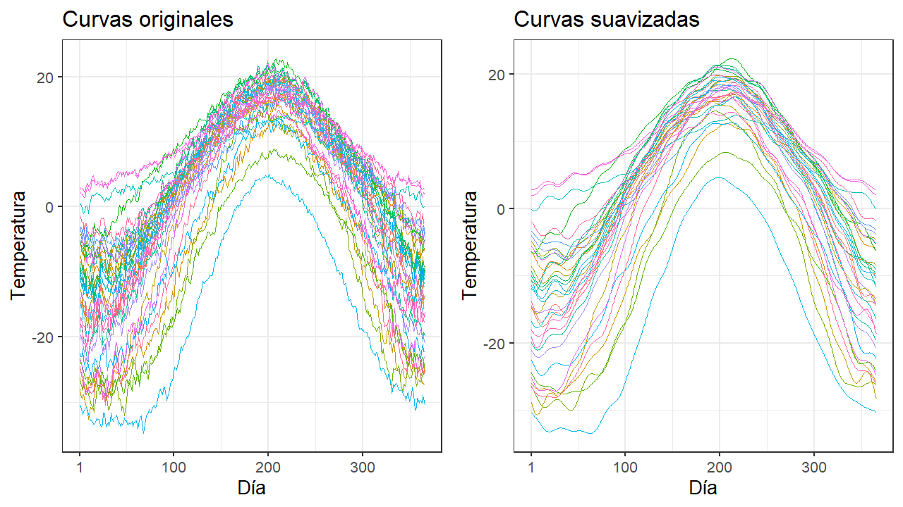

# Introducción al análisis de datos funcionales (FDA) (analisis descriptivo, distancias, algoritmos en funcional)

Los objetivos fundamentales del FDA son los mismos que la estadística convencional e incluyen: (a) Representar y transformar los datos de manera que faciliten el análisis posterior. (b) Mostrar los datos de manera que se destaquen las variables en estudio. (c) Estudiar fuentes relevantes de patrones y variación de los datos. (d) Explicar la variación de una variable resultante o dependiente utilizando la información de la variable independiente [@raichle].

En la estadística elemental las observaciones son escalares, pero en la estadística multivariante las observaciones son vectores que pertenecen al espacio Euclídeo $\mathbb{R}^d$, donde $d$ es la dimensión de los vectores observados. Sin embargo, en el FDA las observaciones son funciones o curvas y aunque estas pueden ser medidas en puntos discretos se las pueden pensar como funciones en espacios infinitos dimensionales [@kokoska].

Los datos funcionales por tanto son una generalización natural de datos multivariantes, pasando de una dimensión finita a una dimensión infinita [@jin]. La alta dimensionalidad de los datos, representa un reto para la teoría y para el cálculo computacional, donde estos retos varían dependiendo de como se tomaron las muestras. Sin embargo, la alta o infinita dimensionalidad de los datos, son una fuente rica en información, lo que conlleva a poder realizar investigaciones y análisis de datos mas robustos [@wang].

La extensa variedad de aplicaciones y herramientas hacen que definir de forma precisa el FDA sea de cierta manera difícil. El FDA surge cuando una variable de interés, en un conjunto de datos, puede ser naturalmente vista como una curva o función suave; entonces el FDA puede pensarse como un análisis de alto nivel estadístico sobre muestras de curvas [@kokoska]. En la práctica, los datos funcionales son obtenidos por medio de observaciones sobre el tiempo, [ESPACIO]{style="color:red"} u otros dominios continuos; los datos funcionales resultantes pueden ser curvas, superficies u objetos complejos [@jin].

[iNSERTAR IMÁGENES DATO FUNCIONAL CON DOMINIOS]{style="color:red"}

Las funciones o curvas pueden ser vistas como realizaciones de un proceso estocástico uno dimensional; usualmente se asume que estas realizaciones pertenecen al espacio de *Hilbert*.\


## Espacios de Hilbert

El espacio de *Hilbert* generaliza la noción de espacio euclidiano, extendiendo las propiedades de dimensión finita para dimensión infinita.

### **El Espacio** $L^2$

El espacio $L^2=L^2[0,1]$ es el conjunto de funciones reales medibles de Lebesgue $f$ definidas en $[0,1]$, tales que satisfacen [@lajos]:

```{=tex}
\begin{align*}
    \int_0^1 f^2(t)dt<\infty
\end{align*}
```
Este espacio se le conoce como el *Espacio de Funciones Cuadrado Integrables*.

Si $f,g \in L^2$, la igualdad $f=g$, significa que [@kokoska]:

```{=tex}
\begin{align*}
    \int[f(t)-g(t)]dt=0
\end{align*}
```
Las funciones cuadrado integrables forman un espacio vectorial; esto significa que, si $f,g\in L^2$, entonces se cumple que, para cualquier escalar $a,b$::

```{=tex}
\begin{align*}
        af+bg\in L^2\hspace{2cm}\\
         (af+bg)(t)=af(t)+bg(t),\ t \in [0,1]
  \end{align*}
```
Se debe tener en cuenta que los elementos de $L^2$ y operaciones sobre estos no necesitan estar definidos para todo punto $t$, sino que están definidos para casi todo punto $t$ [@kokoska].

Para funciones $f,g\in L^2$, se define el producto interno de dos funciones como:

```{=tex}
\begin{align*}
    \langle f,g \rangle=\int f(t)g(t)dt
\end{align*}
```
El producto interno permite entender la noción de ortogonalidad, lo cual hace que la estructura geométrica del espacio $L^2$ sea intuitivamente muy similar al espacio euclidiano finito dimensional.

Se dice que dos funciones $f,g$ son ortogonales si:

```{=tex}
\begin{align*}
    \langle f,g \rangle=0
\end{align*}
```
El producto interno permite definir la noción de distancia entre funciones a través de la norma:

```{=tex}
\begin{align*}
  ||f||=\sqrt{\langle f,f \rangle}=\left\{\int f^2 (t) dt \right\}^{\frac{1}{2}}
\end{align*}
```
Por otro lado, la distancia entre dos funciones en el espacio $L^2$ es la norma de su diferencia; es decir:

```{=tex}
\begin{align*}
    d(f,g)=||f-g||
\end{align*}
```
Un conjunto de funciones $\{e_1,e_2,e_3,...\}$ es una base en $L^2$ si toda función $f\in L^2$ admite una única expansión de la forma:

```{=tex}
\begin{align*}
    f(t)=\sum_{j=1}^\infty {a_je_j(t)}
\end{align*}
```
y se dice que $\{e_1,e_2,e_3,...\}$ es una base ortonormal, si:

```{=tex}
\begin{align*}
    \langle e_j,e_j' \rangle =0,\ j\neq j' \ y\ ||e_j||=1
\end{align*}
```
Para una base ortonormal, como por ejemplo la base de Fourier, se tiene que:

```{=tex}
\begin{align*}
    a_j=\langle f,e_j \rangle
\end{align*}
```
y tenemos la igualdad de *Parseval*:

```{=tex}
\begin{align*}
    \int f^2 (t) dt = ||f||^2 = \sum_{j=1}^{\infty} {\langle f,e_j \rangle ^2} = \sum_{j=1}^{\infty} \left\{\int f(t)e_{j}(t) dt\right\}^2
\end{align*}
```
### **Funciones Aleatorias Cuadrado Integrables**

Dado que $Z$ denota una función aleatoria en $\mathbb{R^d}$. Así, como una variable aleatoria, una función aleatoria es definida en un espacio de probabilidad, digamos $\Omega$; para cada $\omega \in \Omega$, $Z(\omega)$ es una función determinística. Se asume que cada una de las realizaciones $Z(\omega),\omega \in \Omega$, son elementos del espacio $L^2$ de funciones cuadrado integrables, lo que significa que para cada $\omega\in \Omega$, se verifica que:

```{=tex}
\begin{align*}
    ||Z(\omega)||^2=\int \{ Z(\omega)(t)\}^2<\infty
\end{align*}
```
La función $||Z(\omega)||$ es por tanto una variable aleatoria; si esta variable aleatoria tiene momento de segundo orden finito; es decir, $E||Z||^2<\infty$, por consiguiente $Z$ es una función aleatoria cuadrado integrable.

Es importante notar la diferencia entre una función cuadrado integrable determinística, donde la integración se define en el intervalo $[0,1]$, y las funciones aleatorias cuadrado integrables, donde la integración está definida en el espacio de probabilidad $\Omega$ [@kokoska].

### **Estimación de la función de media y covarianza**

En la práctica, se observa una muestra que consiste de $N$ curvas $Z_1,Z_2,...Z_N$; se puede ver cada curva como una realización de una función aleatoria $Z$, o como un elemento aleatorio de $L^2$ con la misma distribución de $Z$. Comúnmente se asume que los $Z_i$ son independientes, en particular si las curvas surgen de mediciones sobre sujetos seleccionados aleatoriamente de una población grande.

Ahora bien, suponiendo que $Z_1,Z_2,...,Z_N$ son iid en $L^2$, y que tienen la misma distribución de $Z$, la cual se asume de cuadrado integrable. De esta forma se define lo siguiente:

-   Función de media:

    ```{=tex}
    \begin{align*}
          \mu(t)=E[Z(t)]
      \end{align*}
    ```

-   Función de media estimada:

    ```{=tex}
    \begin{align*}
          \hat{\mu}=\frac{1}{N}\sum_{i=1}^N Z_i(t)
      \end{align*}
    ```

-   Función de covarianza:

    ```{=tex}
    \begin{align*}
          c(t,s)=E[(Z(t)-\mu(t))(Z(s)-\mu(s))]
      \end{align*}
    ```

-   Función de covarianza estimada:

    ```{=tex}
    \begin{align*}
          \hat{c}(t,s)=\frac{1}{N}\sum_{i=1}^N(Z_i(t)-\hat{\mu}(t))(Z_i(s)-\hat{\mu}(s))
      \end{align*}
    ```

-   Operador de covarianza:

    ```{=tex}
    \begin{align*}
          C=E[\langle(Z-\mu),\cdot \rangle (Z-\mu)]
      \end{align*}
    ```

-   Estimación del operador de covarianza:

    ```{=tex}
    \begin{align*}
          \hat{C}(z)= \frac{1}{N} \sum_{i=1}^{N} \langle Z_i - \hat{\mu}, z\rangle ( Z_i-\hat{\mu}), \quad z\in L^2
      \end{align*}
    ```

Nótese que $\hat{C}$ proyecta el espacio $L^2$ en un subespacio finito dimensional generado por $Z_1,Z_2,...,Z_N$, mostrando las limitaciones de la inferencia estadística para observaciones funcionales; una muestra finita puede cubrir un objeto infinito dimensional solo con reducida exactitud [@lajos].

[INSERTAR GRAFICOS, CODIGO, EJEMPLOS]{style="color:red"} 

## Campos aleatorios funcionales espaciales

## Campos aleatorios funcionales espaciales multivariantes

## Reducción de Dimensionalidad

Como se mencionó, un dato funcional es intrínsecamente infinito dimensional, incluso si un gran número de datos son medidos de manera discreta sobre un conjunto finito de cualquier intervalo la dimensionalidad es alta, produciendo dificultades en el análisis de datos [@kokoska], como la ralentización de algoritmos estadísticos convencionales o incluso produciendo que algunos de estos sean inviables. En algoritmos de clasificación, el costo computacional y la precisión de clasificación pueden ser mejorados de manera significativa utilizando un subconjunto de mediciones representativas; una razón es que instantes en el tiempo consecutivos usualmente están altamente correlacionados, incluyendo redundancias que pueden incrementar el nivel de ruido y ocultar información útil acerca de la estructura de los datos [@tian].

Para tratar el problema de alta dimensionalidad, se hace uso de funciones base, las que constituyen una herramienta para almacenar información acerca de las funciones y da la flexibilidad para combinar el poder computacional para ajustar cientos y miles de observaciones. Además, permite expresar los cálculos requeridos mediante matrices [@ramsay].

El conjunto de datos más simple, en el contexto de FDA, es una muestra de la forma:

```{=tex}
\begin{align*}
    z_n(t_{j,n})\in\mathbb{R}, t_{j,n}\in [T_1,T_2],\ n=1,...,N,\ j=1,...,J_n
\end{align*}
```
es decir, tenemos $N$ curvas que son observadas en un intervalo común $[T_1,T_2]$. Los valores de las curvas nunca son conocidos en todos los puntos $t\in[T_1,T_2]$, pues solo están disponibles en puntos específicos $t_{j,n}$, los cuales pueden ser diferentes para curvas $z_n$ diferentes. Algunas aplicaciones relevantes del FDA, tratan con situaciones donde el número de puntos $\{t_{j,n}\}$, por curva son pequeños. La idea fundamental del FDA es que los objetos en estudio sean curvas suaves:

```{=tex}
\begin{align*}
    \{z_n(t):t\in[T_1,T_2],n=1,...,N\}
\end{align*}
```
para los cuáles los valores $z_n(t)$ existen en todo punto $t$, pero solo son observados en puntos específicos $t_j$.

El enfoque principal en el FDA es la forma de las funciones observadas o de las funciones que resumen las propiedades de los datos en un sentido específico [@kokoska].

### Bases de expansión {.unnumbered}

En la práctica se trabaja con funciones con características que pueden ser impredecibles y complicadas, por lo que se requiere de estrategias para construir funciones que trabajen con parámetros que sean fáciles de estimar y que puedan ser lo más cercano posible a cualquier característica de la curva.

Se utiliza un conjunto de bloques funcionales $\phi_k,k=1,..,K$ llamados *funciones base*, los cuales son combinados linealmente; es decir, una función $z(t)$ definida en este sentido es expresada de la siguiente forma:

```{=tex}
\begin{align*}
    z(t)=\sum_{k=1}^Kc_k\phi_k(t)=c'\phi(t)
\end{align*}
```
conocido como *expansión en funciones base*. Los parámetros $c_1,...c_k$ son coeficientes de la expansión. La expresión matricial usa $c$ para referirse al vector de $K$ coeficientes y $\phi$ para denotar al vector de tamaño $K$ que contiene las funciones suaves de base que comparten las mismas propiedades. [@programsay].

Usualmente se considera una muestra de funciones de tamaño $N$:

```{=tex}
\begin{align*}
    z_i(t)=\sum_{k=1}^Kc_{ik}\phi_k(t), \ i=1,...,N
\end{align*}
```
en este caso, la notación matricial está dada por:

```{=tex}
\begin{align*}
    \textbf{z(t)}=C\phi(t)
\end{align*}
```
donde $\textbf{z(t)}$ es un vector de tamaño $N$ conteniendo las funciones $z_i(t)$, y la matriz de coeficientes $C$ tiene $N$ filas y $K$ columnas [@programsay].

Lo ideal, es que las funciones base tengan características que coincidan con las características de las funciones que se están estimando, lo que permite la obtención de una aproximación adecuada utilizando un número más pequeño que $K$ de funciones; cuánto menor sea $K$ y mejor reflejen las funciones base ciertas características de los datos: se tendrá más grados de libertad para realizar pruebas de hipótesis y calcular intervalos de confianza más precisos, menos cálculo computacional es requerido y es factible que los mismos coeficientes logren describir los datos [@ramsay].

El concepto de sistemas de bases no es nuevo; por ejemplo, un polinomio de cualquier orden, no es más que una combinación lineal de las funciones base monomial $\{1,t,t^2,....,t^n\}$; no obstante, los polimonios no son muy útiles cuando se trabajan con formas funcionales complejas, por lo que, sistemas de base de tipo splines y Fourier son ampliamente utilizados en la práctica [@programsay].

### Bases de Fourier {.unnumbered}

Probablemente la expansión de base más conocida está dada por las series de Fourier. Esta serie es especialmente útil para funciones extremadamente estables; es decir, funciones en las que no hay características locales fuertes y donde la curva tiende a ser del mismo orden en todas partes. Estas series suelen dar lugar a expansiones uniformes, sin embargo son inadecuadas en cierto grado para los datos que se sospecha que tienen discontinuidades en la función o en las derivadas de bajo orden[@ramsay]. En algunas ocasiones, es necesario que las funciones se puedan repetir sobre un cierto período de tiempo $T$; por ejemplo, pueden ser requeridos para expresar comportamiento estacional en series de tiempo extensas. La serie de Fourier, está dada por [@programsay]:

```{=tex}
\begin{align*}
    \phi_1(t)&=1\\
    \phi_2(t)&=\sin(\omega t)\\
    \phi_3(t)&=\cos(\omega t)\\
    \phi_4(t)&=\sin(2\omega t)\\
    \phi_5(t)&=\cos(2\omega t)\\
    & \hspace{0.2cm}\vdots
\end{align*}
```
donde la constante $\omega$ está relacionado con el período $T$ por la relación:

```{=tex}
\begin{align*}
    \omega =\frac{2\pi}{T}
\end{align*}
```
Se observa que, después de la primera función base constante, las funciones base de Fourier son ordenadas de forma sucesiva en pares de seno/coseno, los dos con argumentos en cualquier par que se multiplique por uno de los enteros $1,2,...$ hasta un límite superior $m$. Si las series contienen ambos elementos de cada par, como es usual, el número de funciones base es $K=1+2m$, puesto que, de la forma en que se definió $\omega$, cada función base se repite por si misma después de $T$ unidades de tiempo transcurrido.

Para definir una base de tipo Fourier, solo son necesario dos parámetros: el número de funciones base $K$ y el período $T$; no obstante, este último valor usualmente puede ser por defecto el rango de los valores $t$ en los cuales están definidos los datos [@programsay].

### Base de Splines {.unnumbered}

Las funciones spline son utilizadas usualmente para aproximaciones de datos funcionales no periódicos o perimétricos y estas son parecidas a los polinomios. Esta base ofrece una mayor flexibilidad, sin embargo es más compleja que la series finitas de Fourier. Los splines combinan el cálculo eficiente de los polinomios con una sustancial flexibilidad, usualmente conseguidos con un moderado número de funciones base. El principal camino para ganar flexibilidad en un spline es incrementar el número de puntos de división del intervalo en el cual se define la función [@ramsay].

**Funciones Splines y Grados de Libertad**

Para definir un spline, el primer paso es dividir el intervalo sobre el cual una función va a ser aproximada en $L$ subintervalos separados por valores $\tau_l, l=1,...,L$ que se conocen como *puntos de ruptura* o *nodos*.

El término *puntos de ruptura*, se refiere al número único de valores de los *nodos* mientras el que término *nodos* se refiere a la secuencia de valores en los *puntos de ruptura*, donde algunos *puntos de ruptura* pueden estar asociados con múltiples *nodos*. Todos los *nodos* son distintos en varias aplicaciones, y por tanto *puntos de ruptura* y *nodos* son la misma cosa, sin embargo, se encuentran sistemas de datos de entrada y salida donde las entradas son variadas en un sentido discreto, y estos requieren nodos coincidentes para modelizar estos cambios [@ramsay].

Sobre cada intervalo, un spline es un polinomio de orden específico $m$. El orden de un polinomio es el número de constantes requeridos para definirlo, y a medida que mayor es su grado, más alta es su potencia. El número total de grados de libertad en un ajuste es igual al orden de los polinomios más el número de *puntos de ruptura* en el interior $m+L-1$. *puntos de ruptura* interior, el spline se convierte en un polinomio sencillo. Un spline gana flexibilidad al incrementar el número de *puntos de ruptura*; generalmente se requiere más de estos puntos sobre regiones donde la función presenta la variación más compleja, y menos donde la función es levemente no lineal [@ramsay].

Para splines de grado mayor que uno, los valores de la función están restringidos a ser iguales en su unión, puesto que los polinomios adyacentes se unen suavemente en el punto de ruptura que los separa, incluso las derivadas de orden $m-2$ también deben coincidir en esta unión [@ramsay]

**Base B-Spline**

Este sistema de funciones base $\phi_k(t)$ tiene la siguientes propiedades:

-   Cada función base $\phi_k(t)$ por si misma es un función spline y está definido por un orden $m$ y una secuencia de nodos $\tau$.

-   La combinación lineal de funciones base spline, también es una función spline.

-   Cualquier función spline definida por $m$ y $\tau$ puede expresarse como combinación lineal de estas funciones base.

La propiedad de que una base de funciones B-spline de orden $m$ sea positiva sobre no más de $m$ intervalos, y que estos se junten, es denominada la **propiedad de soporte compacto**, y es de suma importancia para un cálculo computacional eficiente [@ramsay].

La notación $B_k(t,\tau)$ se utiliza para indicar el valor en $t$ de la base de funciones B-spline definido por la secuencia de puntos de ruptura $\tau$; $k$ hace referencia al número del nodo más grande en o inmediatamente a la izquierda de $t$, teniendo en cuenta que cuando los nodos son discretos, se requieren $m+L-1$ funciones base. Una función spline se puede escribir como:

```{=tex}
\begin{align*}
    S(t)=\sum_{k=1}^{m+L-1} {c_{k}B_{k}(t.\tau)}
\end{align*}
```
En cuanto a las posiciones de los nodos $\tau_l$, varias aplicaciones por defecto tienen la misma separación siempre y cuando los datos estén también separados de manera regular. Si no lo están, es recomendable ubicar un nodo en cada punto $j$ de los datos, donde $j$ es un número fijado previamente [@ramsay].

### Estimación de curvas utilizando sistemas de bases por mínimos cuadrados {.unnumbered}

Se tiene por objetivo ajustar observaciones discretas $y_j,j=1,...,n$ utilizando el modelo $y_j=x(t_j)+\epsilon_j$ y se utiliza una base de funciones para la expansión de $x(t)$ de la forma:

```{=tex}
\begin{align*}
    x(t)=\sum_{k=1}^Kc_k\phi_k(t)=\mathbf{c'} \boldsymbol{\phi}
\end{align*}
```
donde el vector $\textbf{c}$ de tamaño $K$ contiene los coeficientes $c_k$ y $\phi$ la matriz de orden $n\times K$ que contiene los valores $\phi_k(t_j)$.

El suavizamiento básico se obtiene si se determinan los coeficientes de la expansión $c_k$ minimizando el criterio de mínimos cuadrados:

```{=tex}
\begin{align*}
    SMSSE(y|c)=\sum_{j=1}^n[y_j-\sum_{k=1}^Kc_k\phi_k(t_j)]^2
\end{align*}
```
en términos matriciales la expresión anterior está dada de la siguiente manera:

```{=tex}
\begin{align*}
    SMSSE(y|c)=(y-\Phi c)'(y-\Phi c)=||y-\Phi c||^2
\end{align*}
```
luego, tomando el criterio de derivada de $SMSSE(y|c)$ con respecto a $\textbf{c}$ tenemos:

```{=tex}
\begin{align*}
    2\Phi \Phi'c-2\Phi'y=0
\end{align*}
```
resolviendo para $\textbf{c}$ tenemos la estimación $\hat{\textbf{c}}$ que minimiza la solución de mínimos cuadrados:

```{=tex}
\begin{align*}
    \hat{c}=(\Phi'\Phi)^{-1}\Phi'y
\end{align*}
```
así, el vector $\hat{y}$ de valores estimados es:

```{=tex}
\begin{align*}
    \hat{y}=\Phi \hat{c}=\Phi(\Phi'\Phi)^{-1}\Phi'y
\end{align*}
```
Este método básico de aproximación es adecuado cuando se asume que los residuos $\epsilon_j$ sobre la curva verdadera son independientes e idénticamente distribuidas con media cero y varianza $\sigma^2$ constante.

**Ajuste por mínimos cuadrados ponderados**

En la práctica se trabaja con errores no estacionarios y/o autocorrelacionados, por lo que se usa el método de mínimos cuadrados ponderados como una extensión del método anterior de la forma:

```{=tex}
\begin{align*}
    SMSSE(y|c)=(y-\Phi c)'W(y-\Phi c)
\end{align*}
```
donde $W$ es una matriz simétrica definida positiva que permite la ponderación de cuadrados y producto de los residuos.

Si la matriz de varianza-covarianza $\Sigma_e$ para los residuos $\epsilon_j$ se conoce, entonces:

```{=tex}
\begin{align*}
    W=\Sigma_e^{-1}
\end{align*}
```
en aplicaciones donde una estimación completa de $\Sigma_e$ no es factible, los valores de la covarianza de los errores son usualmente asumidos iguales a cero, entonces $W$ es diagonal con los recíprocos de la varianza de los errores asociados con los $y_j$.

La estimación $\hat{c}$ de los coeficientes del vector $c$ está dada por:

```{=tex}
\begin{align*}
    \hat{c}=(\Phi'W\Phi)^{-1}\Phi'W'y
\end{align*}
```
### Suavizamiento de datos funcionales mediante el uso de bases de Fourier {.unnumbered}

Una función $f$ continua a trozos en el intervalo de $[-\pi,\pi]$, puede ser representada en un sistema de tipo Fourier de la siguiente manera:

```{=tex}
\begin{align*}
    f(x)=\frac{a_0}{2}+\sum_{k=1}^\infty(a_k\cos{kx}+b_k\sin{kx})
\end{align*}
```
donde, para todo $k$ se tiene que:

```{=tex}
\begin{align*}
    a_k&=\frac{1}{\pi}\int_{-\pi}^\pi f(x)\cos{kx}dx\\
    b_k&=\frac{1}{\pi}\int_{-\pi}^\pi f(x) \sin{kx}dx
\end{align*}
```
esta representación de $f$ se conoce como la expansión en series de Fourier en el intervalo $[-\pi,\pi]$ y donde $a_k,b_k$ son conocidos como los coeficientes de Euler-Fourier de $f$ [@kreider] y este tipo de expansión se utiliza para aproximar datos periódicos.

El suavizamiento de datos, utilizando una base de Fourier, siempre implica que se tenga más puntos de los necesarios para modelizar la suavidad de la función en estudio. En la práctica, la frecuencia de la serie no sobrepasa una frecuencia de corte; es decir, que a partir de cierto término, digamos $m$, todos los coeficientes, $a_k, b_k$, de Fourier serán prácticamente cero; por lo tanto, la ecuación anterior, puede escribirse de la siguiente manera:

```{=tex}
\begin{align*}
     f(x)=\frac{a_0}{2}+\sum_{k=1}^m(a_k\cos{kx}+b_k\sin{kx})
\end{align*}
```
esta ecuación se conoce como la expansión de Fourier truncada y es la función suavizada de nuestros datos.


```{r suaves, echo=FALSE, fig.cap="Suavización de curvas.", fig.height=5, fig.width=10}

```
Usualmente, el intervalo donde una función está definida no es $[-\pi,\pi]$ o $[0,\pi]$; también podría ser un intervalo $[a,b]$ arbitrario, por lo cual la expansión en serie de Fourier queda de la siguiente forma:

```{=tex}
\begin{align*}
    f(x)=\frac{a_0}{2}+\sum_{k=1}^\infty\left(a_k\cos{\frac{2k\pi x}{b-a}} + b_k\sin{\frac{2k\pi x}{b-a}} \right)
\end{align*}
```
donde, para todo $k$:

```{=tex}
\begin{align*}
    a_k&=\frac{2}{b-a}\int_a^bf(x)\cos{\frac{2k\pi x}{b-a}}dx\\
    b_k&=\frac{2}{b-a}\int_a^bf(x)\sin{\frac{2k\pi x}{b-a}}dx
\end{align*}
```
### Suavizamiento de datos funcionales mediante el uso de bases B-splines {.unnumbered}

Se tiene que, en el caso "más general", la estimación del vector de coeficientes $c$, $\hat{c}$ es de la forma:

```{=tex}
\begin{align*}
    \hat{c}=(\Phi'W\Phi)^{-1}\Phi'W'y
\end{align*}
```
donde $\Phi$ es una matriz de orden $n \times K$ que contiene los valores de las $K$ funciones base en los $n$ puntos de muestra, $W$ es la matriz de ponderación que permite tener una estructura de covarianza en los residuos, y $y$ es el vector de los datos discretos a ser suavizados; por tanto, la expresión para el vector de ajuste de los datos es:

```{=tex}
\begin{align}
    \hat{y}=\Phi(\Phi'W\Phi)^{-1} \Phi'Wy=S_\phi y
\end{align}
```
donde $S_\phi$ es el operador proyección correspondiente al sistema de base $\phi$:

```{=tex}
\begin{align*}
    S_\phi=\Phi(\Phi'W\Phi)^{-1} \Phi'W.
\end{align*}
```
Dado que en el proceso de suavización se tiene un comportamiento de discontinuidades, calcular las rugosidades es de utilidad para compensar dicho comportamiento en los datos suavizados.

Para medir la rugosidad de una función, la integral del cuadrado de la segunda derivada $[D^2x(t)]^2$ se utiliza:

```{=tex}
\begin{align*}
    PEN_2(x)=\int[D^2x(s)]^2ds
\end{align*}
```
Para funciones con alta variabilidad, se espera un valor alto de $PEN_2(x)$, pues su segunda derivada es grande al menos en algún rango de interés. De forma general, la penalización de la rugosidad permite una derivada $D^mx$ de orden arbitrario [@ramsay]:

```{=tex}
\begin{align*}
    PEN_m(x)=\int[D^mx(s)]^2ds
\end{align*}
```
matricialmente, la expresión anterior está dada por:

\begin{align*}
    PEN_m(x)=c'Rc
 \end{align*} dónde

```{=tex}
\begin{align*}
    R=\int D^m \phi D^m\phi'.
\end{align*}
```
Ahora bien, añadiendo esta penalización al ajuste por mínimos cuadrados y multiplicando por un parámetro $\lambda$ de suavizamiento, se obtiene:

```{=tex}
\begin{align*}
    PENSSE_m(y|c)=(y-\Phi c)'W(y-\Phi c)+\lambda c'Rc
\end{align*}
```
y tomando la derivada con respecto al vector $c$, se obtiene:

```{=tex}
\begin{align*}
    -2\Phi'Wy + \Phi' W \Phi c + \lambda R c=0
\end{align*}
```
de done la expresión para el vector de coeficientes estimados $\hat{c}$ es:

```{=tex}
\begin{align*}
    \hat{c}=(\Phi W \Phi + \lambda R)^{-1} \Phi' Wy
\end{align*}
```
### Elección de número de bases

## Detección de atípicos

El tratamiento de datos atípicos es un aspecto importante en cualquier análisis estadístico, pese a que los datos atípicos influyen de manera significativa en metodologías estadísticas en varios sentidos, su análisis en datos funcionales ha sido poco abordado [@oviedo].

De manera intuitiva, se podría pensar en la estadística multivariante para tratar casos de datos atípicos en muestras de datos funcionales. Desafortunadamente, hay varios motivos por las que la estadística multivariante falla en el caso funcional. La primera es que los datos funcionales son realizaciones de un proceso aleatorio suave medido en un conjunto discreto de tiempo, por lo cual la estructura de correlación temporal es ignorada cuando se utilizan métodos de estadística multivariante. La segunda es que por la naturaleza infinto-dimensional, los métodos de estadística multivariante son afectados por la alta dimensionalidad; es decir, los métodos no son capaces de manejar las situaciones en donde el número de mediciones de una o más variables es más grande que el número de individuos en la muestra. La tercera es que pocas asunciones sobre la distribución son impuestas sobre los conjuntos de datos funcionales, mientras que los métodos mutlivariantes están implícitamente sujetos a poblaciones Gaussianas [@oviedo].

Los datos atípicos en un conjunto de datos funcionales pueden surgir principalmente por dos razones. La primera es que las curvas pueden tener graves errores de medición, registro o de digitación; estos errores deben ser identificados y corregidos siempre que sea posible. La segunda es que los datos atípicos pueden ser curvas de datos que expresan la realidad, en el sentido de que no tienen errores graves; sin embargo, no se comportan como el resto de curvas. Por tanto, se considera que una curva es un dato atípico si ha sido generado por un proceso estocástico con diferente distribución que el resto de curvas, las cuales se asumen que son idénticamente distribuidas. Una curva puede ser un dato atípico si esta está significativamente alejada del proceso estocástico o si tiene diferente forma y/o comportamiento del resto de curvas [@oviedo].

Para identificar datos atípicos en un conjunto de datos funcionales, se hace uso de la *profundidad funcional*. Este concepto fue originalmente introducido en el análisis multivariante para medir la centralidad de un punto en relación con la nube de puntos; es decir, la profundidad da una forma de ordenar los puntos en un espacio Euclídeo desde el centro hacia el exterior; así, los puntos cercanos al centro tendrán una profundidad más grande [@pinero]. Por otro lado, para datos funcionales, si una curva es un dato atípico, esta curva tendrá una profundidad baja, por lo que para detectar la presencia de datos atípicos funcionales basta analizar las curvas con profundidades más bajas [@oviedo]. Existen tres medidas principales para calcular la profundidad funcional, las cuales son: *Profundidad de Fraiman y Muniz*, *Profundidad H-modal*, y *Profundidad de proyección aleatoria*. Para mayor detalle revisar [@manuel].

### Medidas de profundidad

El objetivo de profundidad para datos funcionales es medir la centralidad de una curva dada $z_i$ dento de un conjunto de curvas $z_1,...,z_n$ generadas por un proceso estocástico $Z(.)$ con muestra de trayectorias en $C[a,b]$, el espacio de las funciones continuas definidas en el intervalo $[a,b]\subset \mathbb{R}$; es decir, la idea bajo la profundidad funcional es medir cuánto tiempo un curva permanece en el centro de todo el grupo de trayectorias [@manuel].

#### Profundidad de Fraiman y Muniz {.unnumbered}

Sea $F_{n,t}(z_i(t))$ la función de distribución acumulada empírica de los valores de las curvas $z_1(t),...,z_n(t)$ en un punto de tiempo $t\in [a,b]$ dado, dado por:

```{=tex}
\begin{align*}
    F_{n,t}(z_i(t))=\frac{1}{n}\sum_{k=1}^n I(z_k(t)\leq z_i(t))
\end{align*}
```
donde $I(.)$ es la función indicatriz.

La medida de profundidad funcional de *Fraiman y Muniz* de una curva $z_i$ con respecto al conjunto de curvas $z_1,...,z_n$, está dada por:

```{=tex}
\begin{align*}
    FMD_n(z_i)=\int_a^bD_n(z_i(t))dt
\end{align*}
```
donde $D_n(z_i(t))$ es la profundidad univariante del punto $z_i(t)$ dada por:

```{=tex}
\begin{align*}
    D_n(z_i(t))=1-\left|\frac{1}{2}-F_{n,t}(z_i(t))\right|
\end{align*}
```
#### Profundidad H-modal {.unnumbered}

Esta medida de profundidad se base en el concepto de moda funcional, definiendo la moda funcional como la curva más densamente rodeada por el resto del conjunto de curvas. Así, la profundidad *h-modal* de una curva $z_i$, con respecto al conjunto de curvas $z_1,...,z_n$, está dada por:

```{=tex}
\begin{align*}
    MD_n(z_i,h)=\sum_{k=1}^n  K\left( \frac{||z_i-z_k||}{h}\right)
\end{align*}
```
#### Profundidad de proyección aleatoria {.unnumbered}

La idea de esta medida es proyectar cada curva funcional y su primera derivada a través de una dirección aleatoria, definiendo un punto en $\mathbb{R}^2$, luego, el valor de la profundidad en $\mathbb{R}^2$, da un orden de puntos proyectados. Si se trabaja con un gran número de proyecciones aleatorias, el valor medio de profundidad de los puntos proyectados define la profundidad para datos funcionales. Así, dado un conjunto de curvas $z_1,...,z_n$ y una dirección $\nu$ que pertenece a un proceso independiente direccional $V(.)$, así la proyección de $z_i$ a través de la dirección $\nu$, está dada por:

```{=tex}
\begin{align*}
    T_{i,\nu}=\langle \nu,z_i \rangle=\int_a^b \nu(t)z_i(t)dt
\end{align*}
```
de manera similar, $T_{i,\nu}'$es la proyección de la derivada de $z_i$ a través de la dirección $\nu$, obteniendo así el par $(T_{i,\nu},T_{i,\nu}')$ que es un punto en $\mathbb{R}^2$. Para $P$ direcciones aleatorias independientes, la profundidad de proyección aleatoria de una curva $z_i$ está definida por:

```{=tex}
\begin{align*}
    RPD_n(z-I)=\frac{1}{P}\sum_{p=1}^P D_n((\langle\nu_{p},z_i \rangle),\langle\nu_p, z_{i}'\rangle), h)
\end{align*}
```
donde $D_n$ es cualquier profundidad definida en $\mathbb{R}^2$ de los puntos $(\langle\nu_p,z_i \rangle,\langle\nu_p,z_i' \rangle) \in \mathbb{R}^2$ [@manuel]. Para la visualización de datos atípicos se han desarrollado varias herramientas gráficas, principalmente propuestas para el caso univariante; sin embargo, para el caso multivariante han sido poco desarrolladas [@dai].

### Gráfico de Magnitudes y Formas

Una de la herramientas gráficas usadas es el \textbf{MS-Plot} o \textbf{Gráfico de Magnitudes y Formas} propuesto por [@dai], el cual se basa en el marco de la periferia funcional direccional, que mide la centralidad de los datos funcionales considerando el nivel y la dirección de sus desviaciones de la región central.\\

\textbf{Periferia Funcional Direccional}\\

Teniendo en cuenta que la externalidad es la medida, grado o cualidad de ser atípico; a este concepto se añade el de dirección, ya que la dirección de externalidad es crucial para describir la centralidad de datos funcionales multivariantes.

De manera formal, la externalidad direccional de un dato escalar está definida por:

```{=tex}
\begin{align*}
    O(Y,F_Y)=\left\{\frac{1}{d(Y,F_Y)-1}\right\}v,\quad d(Y,F_Y)>0
\end{align*}
```
donde $F_Y$ es la distribución de una variable aleatoria, $d$ es una medida convencional de profundidad, y $v$ es el vector unitario que va desde la mediana de $F_Y$ a $Y$. Asumiendo que $Z$ es la única mediana de $F_Y$ para la medida de profundidad $d$, $v$ puede expresarse como:

```{=tex}
\begin{align*}
    v=\frac{Y-Z}{||Y-Z||}
\end{align*}
```
donde $||.||$ es la norma $L_2$.

Ahora bien, si $X$ es una función p-dimensional definida en un dominio $\mathcal{I}$, a partir de la distribución de los datos funcionales $F_X$, para cada punto fijado $t \in \mathcal{I}$, $F_{X(t)}$ es la función de distribución de $X(t)$ con dimensión $p$. De esta forma, se definen tres medidas de externalidad direccional para datos funcionales:

```{=tex}
\begin{itemize}
    \item[1)] Media de externalidad direccional:
    
    \begin{align*}
        MO(X,F_X)=\int_\mathcal{I}O(X(t),F_{X(t)})w(t)dt
    \end{align*}
    
    \item[2)] Variación de externalidad direccional:
    
    \begin{align*}
        VO(X,F_{X})=\int_\mathcal{I} ||O(X(t),F_{X(t)})-MO(X,F_{X})||^2 w(t) dt
    \end{align*}
    
    \item[3)] Externalidad direccional funcional:
    
    \begin{align*}
        F0(X,F_X)=\int_\mathcal{I}||O(X(t),F_{X(t)})||^2w(t)dt
    \end{align*}
    
\end{itemize}
```
donde $w(t)$ es una función de peso definida en $\mathcal{I}$, la cual puede ser constante o proporcional a la variación local en cada punto de diseño; en particular, se usa $w(t)=\{\lambda(\mathcal{I})\}^{-1}$, donde $\lambda(.)$ es la medida de Lebesgue.

Las tres medidas anteriores de externalidad pueden escribirse en una sola ecuación de la siguiente manera:

```{=tex}
\begin{align*}
    FO=||MO||^2 +VO
\end{align*}
```
La ecuación anterior realiza una descomposición total de la externalidad funcional $\textbf{(FO)}$ en dos términos: la magnitud de externalidad ($||\textbf{MO}||$) y la cantidad de variación de externalidad direccional $\textbf{(VO)}$. Esta descomposición permite una gran flexibilidad para describir la centralidad de un conjunto de datos funcionales y para identificar curvas potencialmente atípicas [@dai]. \\

\textbf{MS-Plot}\\

El \textbf{\textit{MS-Plot}} es un gráfico de dispersión de puntos, $(M0',VO)'$, para un grupo de datos funcionales. Cuando la dimensión es más grande que dos, se usa $(||MO||,VO)'$, la cual representa la magnitud general de externalidad y la forma de externalidad sin información de la dirección [@dai].

De las definiciones de MO Y VO, se esperaría que:

-   Las curvas centrales se asignen a la región central baja del MS-Plot; es decir, $||MO||$ pequeño y VO pequeño.

-   Valores atípicos desplazados se sitúan en la región inferior; es decir, $||MO||$ grande y VO pequeño, y las diferentes direcciones de MO indican las diferentes direcciones de sus desplazamientos.

-   Los valores atípicos aislados, que están en una pequeña parte del espacio de soporte, se asignan a la región superior central; es decir, $||MO||$ pequeño y VO grande.

-   Los puntos en la región superior exterior corresponden a las curvas que son sustancialmente atípicas tanto en magnitud como en forma; es decir, $||MO||$ grande y VO grande.

## ANOVA Para datos funcionales

En la práctica se vuelve un problema decidir si existen o no diferencias en el proceso de interés cuando varían condiciones que pueden afectarlo. Este problema se suele abordar mediante un modelo que supone la existencia de una función base que describe la evolución típica del proceso estudiado, suponiendo que los datos con los que se trabaja se han obtenido agregando variaciones aleatorias a esta función. Entonces, este problema se convierte en un tipo de problema de ANOVA funcional [@cuesta].

Existen varios procedimientos para tratar problemas de tipo ANOVA. En el presente trabajo se tratará el problema de *one-way* ANOVA para datos funcionales univariantes, conocido también como el problema de la *prueba de k-muestras*.

### One-Way ANOVA

Este problema puede ser formulado de la siguiente manera:

-   Sea $Z_{i1}(t), Z_{i2}(t),..,Z_{in_i}(t),\ i=1,...,k$, donde $k$ hace referencia a los $k$ grupos de funciones aleatorias definidas sobre un intervalo finito $T=[a,b]$ dado.

-   Sea $SP(m,\gamma)$ un proceso estocástico con función de media $m(t),\ t\in T$ y función de covarianza $\gamma(s,t), st,t\in T$.

-   Asumiendo que $Z_{i1}(t), Z_{i2}(t),..,Z_{in_i}(t)$ son $SP(m_i,\gamma),i=1,..,k$ i.i.d.

Es interesante comprobar la igualdad de las $k$ funciones de media; es decir:

```{=tex}
\begin{align*}
    H_0:m_1(t)&=....=m_k(t),\ t\in T\\
    H_a:m_1(t)&\neq....\neq m_k(t),\ t\in T
\end{align*}
```
A continuación se presentan varias pruebas para este tipo de ANOVA.

#### CS-Test {.unnumbered}

El siguiente estadístico fue propuesto en [@cuevas]:

```{=tex}
\begin{align*}
    V_n=\sum_{1\leq i<j\leq k} n_i\int_T (\bar{Z_i}(t)-\bar{Z_j}(t))^2dt
\end{align*}
```
Bajo la hipótesis nula y la asunción de que :

```{=tex}
\begin{equation*}
 n_i,n \to \infty \quad \text{tal que}\quad  \dfrac{n_i}{n}\to p_i >0,\ i=1,...,k
\end{equation*}
```
se demuestra que la distribución aproximada de $V_n$ es la del estadístico:

```{=tex}
\begin{align*}
    V=\sum_{1\leq i<j\leq k} n_i\int_T \left(\bar{Y_i}(t)-\sqrt{\frac{p_i}{p_j}}Y_j(t)\right)^2dt
\end{align*}
```
donde $Y_1(t),...,Y_k(t)$ son procesos Gaussianos independientes de media cero y función de covarianza $\gamma(s,t)$. El valor crítico empírico se calcula mediante remuestreo sobre $Y_i(t),i=1,..,k$ de un proceso Gaussiano con media cero y función de covarianza $\hat{\gamma}$, definida por:

```{=tex}
\begin{align*}
    \hat{\gamma}(s,t)=\frac{1}{n-k}\sum_{i=1}^k\sum_{j=1}^{n_i}(Z_{ij}(s)-\bar{Z_i}(s))(Z_{ij}(t)-\bar{Z_i}(t))
\end{align*}
```
Para el caso heterocedástico y mediante el cálculo del valor crítico empírico, el valor p de $V_n$ puede calcularse como en el caso anterior, mediante procesos Gaussianos independientes con funciones de covarianza dadas por:

```{=tex}
\begin{align*}
    \hat{\gamma_i}(s,t)=\frac{1}{n_i-1}\sum_{j=1}^{n_i}(Z_{ij}(s)-\bar{Z_i}(s))(Z_{ij}(t)-\bar{Z_i}(t))
\end{align*}
```
#### Prueba basadas en la norma $\mathcal{L}^2$ {.unnumbered}

Este test usa el siguiente estadístico:

```{=tex}
\begin{align*}
    S_n=\int_T SSR_n(t)dt 
\end{align*}
```
donde:

```{=tex}
\begin{align*}
     SSR_n(t)&=\sum_{i=1}^k n_i(\bar{Z}_i(t)-\bar{Z}(t))^2\\
     \bar{Z}(t)&=\frac{1}{n}\sum_{i=1}^k \sum_{j=1}^{n_i}Z_{ij}(t)\\
     \bar{Z}_i(t)&=\frac{1}{n_i}\sum_{j=1}^{n_i}Z_{ij}(t)
 \end{align*}
```
Bajo la hipótesis nula, se tiene que $S_n\sim \beta \chi_d^2$ aproximadamente, donde:

```{=tex}
\begin{align*}
    \beta &=\frac{tr(\gamma^{\otimes 2})}{tr(\gamma)},\\
    d&=(k-1)\kappa,\\
    \kappa&=\frac{tr^2(\gamma)}{tr(\gamma^{\otimes 2})},\\
    \gamma^{\otimes 2}(s,t)&=\int_T \gamma(s,u)\gamma(u,t)du.
\end{align*}
```
Esta distribución aproximada es usada para calcular el p-valor de $S_n$; es decir, $P(\chi_d^2\geq S_n/\beta)$ o su valor crítico $\beta\chi_d^2(1-\alpha)$. Los parámetros $\beta$ y $\kappa$ son estimados con base en los datos funcionales por el método de \textit{naive} o el método de \textit{reducción de sesgo}.

Utilizando el método naive, y con el estimador $\hat{\gamma}(s,t)$, se tiene que:

```{=tex}
\begin{align*}
    \hat{\beta}&=\frac{tr(\hat{\gamma}^{\otimes 2})}{tr(\hat{\gamma})},\\
    \hat{d}&=(k-1)\hat{\kappa},\\
    \hat{\kappa}&=\frac{tr^2(\hat{\gamma})}{tr(\hat{\gamma^{\otimes 2}})}.
\end{align*}
```
Utilizando el método de reducción de sesgo, se tiene que:

```{=tex}
\begin{align*}
    \hat{\beta}&=\frac{\widehat{tr(\gamma^{\otimes 2})}}{tr(\hat{\gamma})},\\
    \hat{d}&=(k-1)\hat{\kappa},\\
    \hat{\kappa}&=\frac{\widehat{tr^2(\gamma)}}{\widehat{tr(\gamma^{\otimes 2}})},\\
    \widehat{tr(\gamma^{\otimes 2})}&=\frac{(n-k)^2}{(n-k-1)(n-k+2)}\left(tr(\hat{\gamma}^{\otimes 2})-\frac{tr^2(\hat{\gamma})}{n-k} \right),\\
    \widehat{tr^2(\gamma)}&=\frac{(n-k)(n-k+1)}{(n-k-1)(n-k+2)}\left(tr^2(\hat{\gamma})-\frac{2tr(\hat{\gamma}^{\otimes 2})}{n-k+1}\right).
\end{align*}
```
#### Prueba F {.unnumbered}

Este test usa el estadístico:

```{=tex}
\begin{align*}
    F_n&=\frac{\int_T SSR_n(t)dt/(k-1)}{\int_T SSE_n(t)dt/(n-k)}\\
    SSE_n(t)&=\sum_{i=1}^k\sum_{j=1}^{n_i}(Z_{ij}(t)-\bar{Z}_i(t))^2
\end{align*}
```
Bajo la hipótesis nula, se tiene que $F_n \sim F_{d_1,d_2}$ aproximadamente, donde $d_1=(k-1)\kappa$ y $d_2=(n-k)\kappa$. De manera similar, la distribución aproximada de la prueba \textit{F} puede ser usada para calcular el p-valor de $F_n$ o su valor crítico; y el parámetro $\kappa$ puede ser estimado por el método naive o el método de reducción de sesgo.

Cuando las muestras nos son Gaussianas o son pequeñas, estas pruebas no son utilizadas; en este caso, las versiones bootstrap de estas pruebas son usadas para calcular el p-valor de $S_n$ y $F_n$ [@gorgi].\\

#### Prueba basada en representación de funciones base {.unnumbered}

Se puede utilizar una función de representación de base para obtener una prueba más robusta.

Asumiendo que se trabaja con $k$ grupos de un proceso estocástico $Z_{ij}\in L_2(T), i=1...,k,j=1,...,n_i$ y sea $\{\phi_l\}$ una base ortonormal de $L_2(T)$.

Esta prueba usa el siguiente estadístico:

```{=tex}
\begin{align*}
    F=\frac{\frac{1}{k-1}\sum_{i=1}^k n_i||\bar{Z}_i-\bar{Z}||^2}{\frac{1}{n-k}\sum_{i=1}^k\sum_{j=1}^{n_i} ||Z_{ij}-\bar{Z_i}||^2}
\end{align*}
```
donde el proceso estocástico, la media funcional muestral y media funcional grupal, escrita en notación matricial a partir de la representación en la base $\phi$, están definidos de la siguiente manera:

```{=tex}
\begin{align*}
    Z_{ij}(t)&=c'_{ij}\phi(t),\\
    \bar{Z}(t)&=\frac{1}{n}\sum_{i=1}^k\sum_{j=1}^{n_i} c'_{ij}\phi(t), \quad \forall t\in T\\
    \bar{Z}_i(t)&=\frac{1}{n_i}\sum_{j=1}^{n_i}c'_{ij}\phi(t)
\end{align*}
```
para todo $t\in T$.

El numerador del estadístico \textit{F}, mide la variabilidad externa entre las diferentes muestras, mientras que el denominador mide la variabilidad interna dentro de las muestras [@cuevas].
